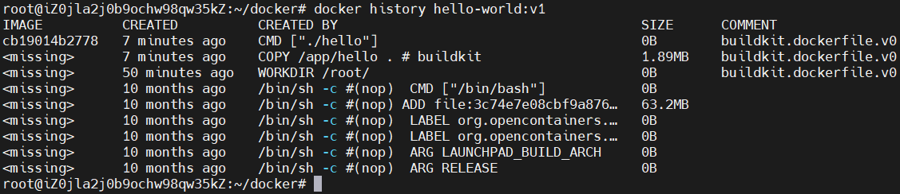
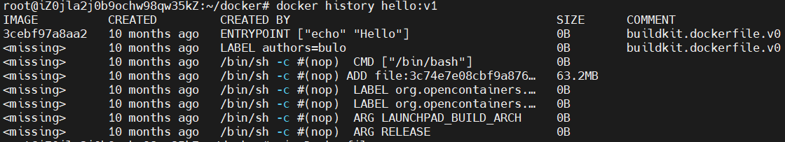
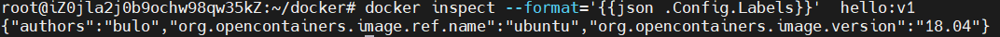

## FROM 指定基础镜像

基础镜像是构建镜像的起点，定制镜像都需要以一个镜像为基础，然后对其进行修改，From就是用来指定基础镜像的，因此Dockerfile中From是必备的指令，而且必须是第一条。

Docker中存在一个特殊镜像名为 scratch 这个镜像并不存在，仅表示一个空白的镜像，下一条指令会作为镜像的第一层存在。

FROM 指令还可以用于实现多段构建，这在需要进行多个步骤来构建镜像时非常有用。例如，在第一个阶段构建代码，第二个阶段将构建的代码复制到最终镜像中。多阶段构建可以减小最终镜像的大小，因为只有构建时需要的文件和依赖项才会被包含在镜像中，而构建过程中生成的临时文件则会被丢弃。

示例：

创建docker文件夹，并在目录下创建Dockerfile文件

```bash
mkdir docker
cd docker 
vim Dockerfile
```

在Dockerfile中写入：

```dockerfile
# 第一个阶段：构建二进制文件
FROM golang:latest AS builder
# 指定工作目录
WORKDIR /app
# 将上下文路径内容复制到工作目录
COPY . .
# 编译二进制文件
RUN go env -w GO111MODULE=off \
    && go build hello.go

# 第二个阶段：构建最终镜像
FROM ubuntu:18.04
WORKDIR /root/
# 从第一个阶段复制二进制文件到最终镜像中
COPY --from=builder /app/hello .
# 设置容器启动命令
CMD ["./hello"]
```

再创建一个go文件

```bash
vim hello.go
```

写入：

```go
package main

import "fmt"

func main() {
	fmt.Println("Hello World")
}
```

执行：

```bash
docker build -t hello-world:v1 .
docker run --rm hello-world:v1
```

可以看到输出Hello World 。

用docker history 指令查看创建的镜像，只看到最后一个FROM后的指令：

```bash
docker history hello-world:v1
```



## RUN 执行命令

RUN指令用于在镜像**构建过程**中执行命令，有两种语法格式：

shell 格式：

```dockerfile
RUN <command>
```

示例：

```dockerfile
RUN apt-get update && apt-get install -y \
    package1 \
    package2 \
    package3
```

exec 格式:

```dockerfile
RUN ["executable", "param1", "param2"...]
```

示例：

```dockerfile
RUN ["apt-get", "update"]
RUN ["apt-get", "install", "-y", "package1", "package2", "package3"]
```

缓存机制：当使用Dockerfile构建镜像时，Docker会检查每一步的缓存。如果之前已经构建过相同的镜像且镜像层没有发生变化，Docker会直接复用之前的镜像层，避免重复的构建工作，加快镜像的构建速度。

## COPY 复制文件

格式如下：

```dockerfile
COPY <源路径>... <目标路径> // 格式1
COPY ["源路径",..."目标路径"] //格式2
```

源路径以上下文路径为基础。

...指可以有多个源路径，但是目标路径只能有一个。

如果源路径为文件夹，复制的时候不是直接复制该文件夹，而是将文件夹中的内容复制到目标路径。

源路径可以是通配符，但是需要满足GO的[filepath.Match](https://golang.org/pkg/path/filepath/#Match)规则

示例：

```
COPY hom* /mydir/
COPY hom?.txt /mydir/
```

默认情况下，COPY 指令会保留文件或目录的原始权限和所有者。如果需要更改文件的权限或所有者，可以使用 --chown选项。

```
COPY [--chown=<user>:<group>] <源路径>... <目标路径>
COPY [--chown=<user>:<group>] ["<源路径>",... "<目标路径>"]
```

在多段构建时可以使用--from选项来指定从某个阶段复制文件。

```
COPY [--from=builderName] <源路径>... <目标路径>
COPY [--from=builderName] ["<源路径>",... "<目标路径>"]
```

## ADD 高级文件复制

ADD指令与 COPY指令类似，都是用于将文件或目录从主机（构建上下文）复制到 Docker 镜像中的指定位置。但 `ADD` 指令在功能上更加强大，它除了复制文件外，还支持自动解压缩压缩包、支持 URL 地址。

```
ADD [--chown=<user>:<group>] <源路径>... <目标路径>
```

如果源路径是一个压缩文件（`.tar`, `.tar.gz`, `.tgz`, `.tar.bz2`, `.tbz2`, `.tar.xz`, `.txz`, `.zip`）会被自动解压缩到目标路径

如果源路径是一个URL，会被下载到目标路径。

注：ADD 会使镜像缓存失效，可能会导致镜像构建缓慢。在复制文件时，应当尽可能使用COPY，仅在需要自动解压缩的场景使用ADD。

## CMD 容器启动命令

格式与RUN相近：

```dockerfile
CMD <command> // shell格式
CMD ["executable", "param1", "param2"...] // exec格式
```

CMD 命令用于指定容器启动时执行的默认命令。

如果在 Dockerfile 中有多个 CMD 指令，则只有最后一个会生效。

通常情况下，推荐使用 Exec 格式，因为它更加明确和可靠。Shell 形式可能会受到 shell 环境的影响，而且可能会导致一些不可预测的问题。

容器中的应用都应该以前台执行，容器没有后台的概念，如果后台执行可能会导致容器退出。

docker run 提供的参数列表会覆盖掉CMD的参数列表，如：

在Dockerfile中写入：

```dockerfile
FROM ubuntu:18.04
CMD ["echo","Hello"]
```

执行：

```bash
docker build -t hello:v1 .
docker run --rm hello:v1 "echo" "hello world"
```

可以看到容器输出 hello world 而不是 Hello

## ENTRYPOINT 入口点

格式与CMD相近：

```dockerfile
ENTRYPOINT <command> // shell格式
ENTRYPOINT ["executable", "param1", "param2"...] // exec格式
```

ENTRYPOINT指令和CMD指令都是指定容器启动时的指令和参数，但docker run 提供的参数列表不会覆盖掉ENTRYPOINT的参数列表，而是会添加到参数列表后，如：

在Dockerfile中写入：

```dockerfile
FROM ubuntu:18.04
ENTRYPOINT ["echo","Hello"]
```

执行：

```bash
docker build -t hello:v2 .
docker run --rm hello:v2 "World"
```

可以看到容器输出 Hello World

当CMD与ENTRYPOIN一起使用时，CMD的参数会传给ENTRYPOINT，如：

在Dockerfile中写入：

```dockerfile
FROM ubuntu:18.04
ENTRYPOINT ["echo","Hello"]
CMD ["World"]
```

执行：

```bash
docker build -t hello:v3 .
docker run --rm hello:v3 
```

可以看到容器输出Hello World。

--rm选项删除了容器，镜像还在，可以使用下面指令删除掉刚刚创建的几个镜像：

```bash
docker image rm $(docker image ls hello -q)
```

## ENV 设置环境变量

ENV 指令用于在 Dockerfile 中设置环境变量，类似给一个值设置别名。ENV设置的环境变量可以在容器运行时被应用程序使用。ENV 指令的基本语法如下：

```dockerfile
ENV <key> <value>                      // 格式1
ENV <key1>=<value1> <key2>=<value2>... // 格式2
```

示例：

在Dockerfile写入：

```dockerfile
FROM ubuntu:18.04
ENV HW Hello_World
RUN ["echo","$HW"]
```

执行：

```bash
docker build -t hw:v1 . 
```

可以在构建信息中看到，RUN指令的参数列表实际为["echo","Hello World"]

```
=> [2/2] RUN ["echo","Hello_World"] 
```

下列指令可以支持环境变量展开： `ADD`、`COPY`、`ENV`、`EXPOSE`、`FROM`、`LABEL`、`USER`、`WORKDIR`、`VOLUME`、`STOPSIGNAL`、`ONBUILD`、`RUN`。

不支持的有：`CMD`、`ENTRYPOINT`

注：FROM虽然支持展开，但ENV不能在第一行，否则会输出错误：

```bash
ERROR: failed to solve: no build stage in current context
```

## ARG 构建参数

格式：

```dockerfile
ARG <参数名>[=<默认值>]
```

ARG 与 ENV 的效果一样，都是设置环境变量，区别是ARG在容器运行时无效，仅在构建过程中生效。

ARG用于构建过程中的参数传递，使用这个指令并不创建新的层，因此可以在第一个FROM之前使用，而 ENV 是用于设置镜像和容器的运行环境，会创建新的层，因此必须在 FROM之后使用。

生效范围：若在第一个FROM之前指定，则仅在**每个**FROM指令中生效。在多段构建中，FROM后指定的ARG只在当前阶段生效。

注：ARG的参数可以在构建命令 `docker build` 中用 `--build-arg <参数名>=<值>` 来覆盖。

灵活的使用 `ARG` 指令，能够在不修改 Dockerfile 的情况下，构建出不同的镜像。

## VOLUME 定义匿名卷

格式：

```
VOLUME <路径>
VOLUME ["<路径1>", "<路径2>"...]
```

容器运行时应该尽量保持容器存储层不发生写操作，对于动态的数据应当保存在VOLUME中。在 Docker 中，Volume（卷）是用于持久化存储数据的机制，允许容器与宿主机之间共享数据。Volumes 可以在容器的生命周期内持续存在，即使容器被删除，数据也可以保留在宿主机上。

如：

```dockerfile
VOLUME /data
```

在容器中任何对/data文件夹的写入都不会记录在容器存储层，而是保存在宿主机的/data文件夹中，而容器从宿主机中读取数据。

## EXPOSE 声明端口

格式：

```dockerfile
EXPOSE <端口1> [<端口2>...]
```

EXPOSE 仅用于说明该容器运行时的有哪些提供服务的端口，并无实际用处，类似于注释提高可读性。该指令与ARG指令一样并不会新建层。

若需要暴露容器端口并映射到宿主机端口需要在docker run时使用`-p <宿主端口>:<容器端口>`选项：
如：

```bash
docker run --name web -d -p 8000:80 nginx
```

## WORKDIR 指定工作目录

WORKDIR 指令用于指定工作目录，以后各层的当前目录就被改为指定的目录

如该目录不存在，`WORKDIR` 会新建目录。

可以使用绝对路径或相对路径来指定工作目录。如果使用相对路径，则会相对于上一个 `WORKDIR` 指令设置的目录。

如：

```dockerfile
WORKDIR /hello
WORKDIR world

RUN pwd
```

`RUN pwd` 的工作目录为 `/hello/world`。

## USER 指定当前用户

格式：

```
USER <用户名>[:<用户组>]
```

USER 指令和 WORKDIR 相似，都是改变环境状态并影响以后的层。WORKDIR 是改变工作目录，USER 则是改变之后层的执行 RUN, CMD以及 ENTRYPOINT这类命令的身份。

注:USER 只是切换到指定用户而已，这个用户必须是事先建立好的，否则无法切换。

## HEALTHCHECK 健康检查

格式：

```dockerfile
HEALTHCHECK [选项] CMD <命令> // 设置检查容器健康状况的命令
```

```dockerfile
HEALTHCHECK NONE // 屏蔽基础镜像的健康检查指令
```

Docker 的 HEALTHCHECK 是用于在容器运行时检查容器内服务或应用程序的状态的机制。通过 HEALTHCHECK，可以告诉 Docker 应该如何进行判断容器的状态是否正常。没有HEALTHCHECK指令时，Docker只会在主进程退出时认为容器状态不正常，而进程陷入死锁或者死循环等不正常状态时Docker不会理会。

选项：

`--interval=<间隔>`：两次健康检查的间隔，默认为 30 秒；
`--timeout=<时长>`：健康检查命令运行超时时间，如果超过这个时间，本次健康检查就被视为失败，默认 30 秒；
`--retries=<次数>`：当连续失败指定次数后，则将容器状态视为`unhealthy`，默认 3 次。

HEALTHCHECK指令只有最后一条生效，后面的会覆盖掉前面的。


CMD格式与CMD指令一致，需要有返回值，命令的返回值决定这次HEALTHCHECK的结果：**`0`：成功**；`1`：失败；`2`：保留，不要使用这个值。

如：

```dockerfile
HEALTHCHECK CMD <command> || exit <code>
```

`||` : Shell 中的逻辑 OR 运算符，表示如果前面的命令失败（返回非零退出码），则执行接下来的命令。

`exit <code>` :用于退出当前脚本，并且返回一个退出码。

健康检查命令的输出（包括 `stdout` 以及 `stderr`）都会被存储于健康状态里，可以用 `docker inspect` 来查看：

```bash
docker inspect --format '{{json .State.Health}}' <container_name>
```

可以在命令末尾添加json工具命令进行格式化输出，如：

```
docker inspect --format '{{json .State.Health}}' <container_name> | python -m json.tool
```
## ONBUILD 构建触发器

`ONBUILD` 用于定义镜像构建触发器，当一个镜像包含 `ONBUILD` 指令时，这个指令将不会立即执行，而是在该镜像作为另一个镜像的基础镜像（父镜像）进行构建时触发。当需要构建多个镜像，但各个镜像中有重复部分的场景，就可以使用ONBUILD构建一个基础镜像，然后其他镜像以这个基础镜像进行构建。这样的好处在于减少重复代码的编写，并且如果基础镜像出现错误或者纰漏时，只需修改基础镜像并根据Dockerfile重新构建其他镜像即可，这无疑大大提高了镜像的可维护性与Dockerfile的编写效率。

示例：

在docker文件夹外，新建文件夹baseDocker并创建一个Dockerfile：

```
mkdir baseDocker
cd baseDocker
vim Dockerfile
```

输入：

```dockerfile
FROM golang:latest 

WORKDIR /app

ONBUILD COPY . .

ONBUILD RUN go env -w GO111MODULE=off \
    && go build hello.go
```

执行：

```bash
docker build -t base:v1 .
```

回到docker文件夹在Dockerfile中输入:

```dockerfile
# ONBUILD构建的基础镜像
FROM base:v1 AS builder

FROM ubuntu:18.04
WORKDIR /root/
COPY --from=builder /app/hello .
CMD ["./hello"]
```

执行：

```
docker build -t hello-world:v1 .
docker run --rm hello-world:v1
```

可以看到容器输出Hello World。

ONBUILD的指令会延迟到作为父镜像构建新镜像时执行，这样可以获取到足够的信息。比如上下文路径，如果不使用ONBUILD ，构建基础镜像时的上下文路径已经定死了，后续镜像只能在基础镜像的上下文路径中构建，这显然是不可行的。

## LABEL 添加元数据

格式：

```docker
LABEL <key>=<value> <key>=<value> <key>=<value> ...
```

`LABEL` 指令用于向 Docker 镜像添加元数据，通常用来提供关于镜像的描述信息、版本信息、维护者信息等。这些标签信息可以帮助用户更好地理解和使用镜像，也可以在构建镜像时提供一些有用的信息。

注：LABEL也会新建一层，所以尽可能使用一个LABEL避免镜像臃肿。

如果在第一个FROM前使用LABEL会输出错误：

```bash
ERROR: failed to solve: no build stage in current context
```

在Dockerfile中输入：

```dockerfile
FROM ubuntu:18.04

LABEL authors="bulo"

ENTRYPOINT ["echo","Hello"]
```

执行:

```bash
docker build -t hello:v1 .
docker history hello:v1
```

可以看到LABEL指令创建的层



镜像被添加的元数据也可以用 `docker inspect` 来查看：

```bash
docker inspect --format='{{json .Config.Labels}}' <image_name>
```
执行：

```bash
docker inspect --format='{{json .Config.Labels}}'  hello:v1 
```



## SHELL 指定解释器

格式：

```dockerfile
SHELL ["executable", "parameters"]
```

`SHELL` 指令用于设置 Dockerfile 中后续指令的默认解释器,比如在执行 `RUN`、`CMD`、`ENTRYPOINT` 等命令时使用的 Shell 解释器。默认情况下，Docker 使用 `/bin/sh -c` 作为默认的 Shell 解释器。

如使用bash作为默认解释器：

```
SHELL ["/bin/bash", "-c"]
```


PS：阿巴阿巴阿巴......