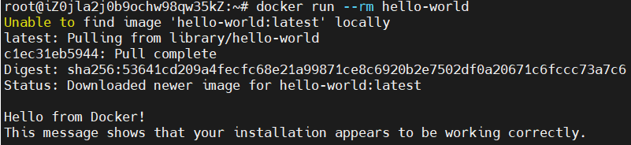
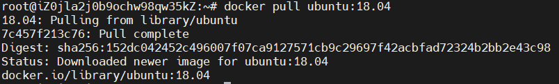
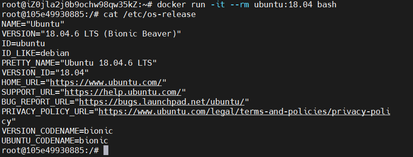
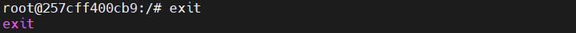
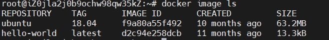
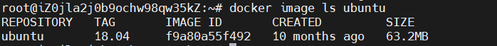
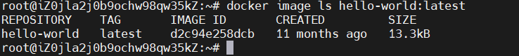
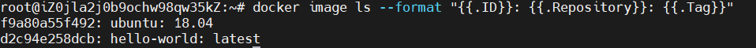

# Docker

官方文档 [Docker overview | Docker Docs](https://docs.docker.com/get-started/overview/)

中文文档 [Docker -- 从入门到实践 (docker-practice.github.io)](https://docker-practice.github.io/zh-cn/)

Docker是一个开源平台，用于开发、部署和运行应用程序。它采用容器化技术，允许开发者将应用程序及所有依赖项打包进一个独立可移植的容器中。这些容器可以在任何支持Docker的环境中运行，无论是个人计算机还是云端服务器。采用Docker技术部署应用程序，可以显著缩短代码开发到项目部署之间的延迟。

## 基本概念

### container

container（容器）是代码的隔离环境，不受宿主系统环境影响，其中包含了应用程序的代码、运行时环境、系统工具、系统库以及相关设置。应用程序的所有依赖项都被打包到一起，使得容器可以独立地运行。

### image

image（镜像）是一个只读文件，其中包含了用于创建container的文件系统内容。image一旦创建不可被修改，只能在现有的image基础上创建一个新image，并在其中应用所需的修改。image由层组成，每一层表示一组系统文件修改，用于添加、删除或者修改文件。

### registry

registry是一个集中存储、分发docker image的服务器，用于管理image的存储和检索。通俗地讲，registry是一个docker image 的仓库。使用 docker pull 命令可以从Registry中拉取镜像到本地，通过 docker push 命令可以将本地 docker image 推送到Registry中。

### Docker Compose

当想要使用容器实现复杂的事情时，可能会用到数据库、消息队列或者其他各种服务。如果把它们都打包到一个容器中，维护起来会十分复杂，更好的做法是使用多个容器，每一个容器只做一件事情。但是使用docker run 来运行多个容器，又会变得难以管理，这个时候就需要借助docker compose工具。docker compose 是一个定义和运行多个docker容器应用的工具。它使用yaml文件来配置容器的服务、网络和卷，当配置发生改变时只需再次执行 docker compose up 命令就可以让docker compose协调这些改变并且应用它们。 通过docker compose，开发者可以轻松定义、启动、停止和销毁由多个容器构成的应用程序。

## 基本使用

### 安装

#### Ubuntu

可以使用以下命令卸载docker

```shell
for pkg in docker.io docker-doc docker-compose docker-compose-v2 podman-docker containerd runc; do sudo apt-get remove $pkg; done
```

官方脚本安装

```bash
curl -fsSL get.docker.com -o get-docker.sh
sudo sh get-docker.sh --mirror Aliyun
```

验证是否安装成功

```bash
docker run --rm hello-world
```



如果没有找到本地镜像，docker会到registry中拉取所需镜像。

### 获取镜像

命令格式：

```bash
docker pull [选项] [Docker Registry 地址[:端口号]/]仓库名[:标签]
```

registry地址默认为docker hub（docker.io）,标签默认为latest

示例：

```
docker pull ubuntu:18.04
```



### 运行镜像

```bash
docker run -it --rm ubuntu:18.04 bash
```

-it 是两个参数，-i 是指交互式操作，-t是指终端，bash是我们希望使用的交互式终端

--rm 指容器退出后将容器删除



输入exit 退出

```bash
exit
```



### 列出镜像

列出所有顶层镜像：

```
docker image ls
```



根据仓库名列出镜像：

```
docker image ls ubuntu
```



列出指定镜像

```
docker image ls hello-world:lastest
```




格式化列出内容

```bash
docker image ls --format "{{.ID}}: {{.Repository}}: {{.Tag}}"
```



### 删除镜像

命令格式：

```
docker image rm [选项] <镜像1> [<镜像2> ...]
```

其中<镜像>可以是镜像ID、镜像名字或镜像摘要，一般通过镜像ID删除，镜像ID很长，但是可以取其某个长度的前缀，只要可以区别于其它镜像就行。

如删除hello-world：latest镜象：

```bash
docker image rm d2c
```


