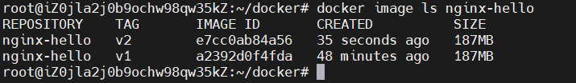

# 镜像定制

## docker commit

docker image是多层存储，每一层都是在前一层的基础上进行修改，而container也是多层存储结构，它会在image的基础之上创建一层运行时存储层，所有对下层镜像的修改都在这一层记录，比如删除了下层镜像中的某一个文件，并不是真的删除了（image是只读的），只是在存储层中将这个文件标记为已删除。我们可以使用docker commit 将container的存储层和下层基础镜像整个打包成一个新镜像。

注：这种方法仅用于理解镜像的构成和一些像入侵后保留现场的特殊场合。在定制镜像时应当避免使用docker commit，因为除了制作者，没人能够知道这个镜像里执行了哪些指令，维护十分困难。并且这种方法定制的镜像会存在大量的无关内容，使镜像极为臃肿。

以一个web服务器为例：

```bash
docker run --name web -d -p 8000:80 nginx
```

--name 之后跟着的是创建容器的名字,这里设置成web。

-d 指在后台运行。

-p 8000:80 指将容器中的80端口映射到宿主机的8000端口上，可以通过宿主机的localhost:8000访问到容器中的web服务器。

nginx 指基于nginx镜像创建容器。


访问localhost:8000 可以看到如下网页，如果是云服务器可以在安全组开放相应端口后访问<服务器IP>:<端口>查看到该网页。


接下来，对这个网页进行一点修改：

使用 docker exec 进入容器中，向nginx的index页写入Hello World的html标签后使用exit退出容器。

```
docker exec -it web bash
echo '<h1>Hello, World!</h1>' > /usr/share/nginx/html/index.html
eixt
```


再次访问web服务器，可以看到发生了变化。


可以通过如下指令查看容器发生的变化：

```
docker diff web
```


接下来使用docker commit 将这些变化连同下层镜像保存下来：

```bash
docker commit [选项] <容器ID或容器名> [<仓库名>[:<标签>]] // 命令格式
```

```
docker commit \
--author "xxx <xxxxxxx@xx.xxx>" \
--message "changed index.html" \
web \
nginx-hello:v1
```

--author 指定修改作者的信息

--message 记录本次修改的相关信息

web 是刚修改的web服务器的容器名

nginx-hello:v1 是新建镜像的名字和版本号


输入docker image ls查看到刚才创建的naginx-hello镜像

```bash
doceker image ls
```


使用docker history命令可以查看镜像内的commit记录

```
docker history nginx-hello:v1
```

可以看到新增了一层


使用新镜像创建容器：

```
docker run --name web2 -d -p 8080:80 nginx-hello:v1
```


访问宿主机端口8080可以看到已经被修改过的网页


使用docker ps 可以看到所有运行中的容器


使用docker stop [container id]可以停止对应容器也可以使用如下指令停止所有容器：

```
docker stop $(docker ps -q)
```


docker ps -q 会列出所有容器的id

## Dockerfile

从docker commit 中可知，镜像的制作其实就是对每一层所添加的配置、文件。如果可以将定义每一层的一系列指令和命令写入一个脚本，让这个脚本去构建和定制镜像，那么commit导致的一系列问题都会得到解决，这个脚本就是Dockerfile。

同样以之前的web服务器为例：

这次先创建一个docker文件夹，并在文件夹下创建Dockerfile文件

```
mkdir docker
cd docker
vim Dockerfile
```

在文件中写入：

```dockerfile
FROM nginx
RUN echo '<h1>Hello, World!</h1>' > /usr/share/nginx/html/index.html
```

按下i键进入insert模式写入，依次按下esc键与: 键后输入wq退出  


FROM指定基础镜像为nginx

RUN后是创建容器后执行的指令

注：在Dockerfile中的每一条指令都会新建一层，因此如果有多条RUN命令，最好使用&&符将其连接，减少镜像中的层数

接下来使用docker build构建镜像：

```
docker build [选项] <镜像名> <上下文路径/URL/->
```

```
docker build -t nginx-hello:v2 .
```

Docker采用的是C/S设计，分为客户端（主机）与服务端（Docker引擎），上下文路径是需要将其打包上传给Docker服务端的目录路径，Docker引擎通过识别上下文路径中的Dockerfile与其他文件来构建镜像，并将镜像返回给客户端。


使用docker image ls命令可以看到新的v2 image

```
docker image ls nginx-hello
```



使用v2镜像创建容器：

```
 docker run --name web3 -d -p 8000:80 nginx-hello:v2
```


访问网页，可以看到已经修改的内容


