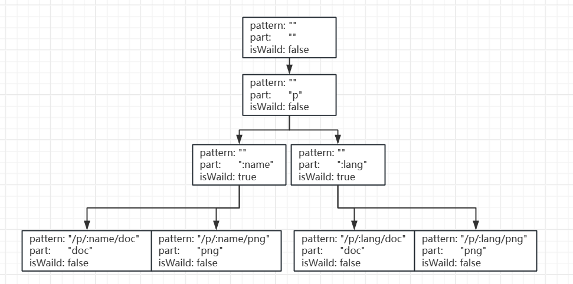
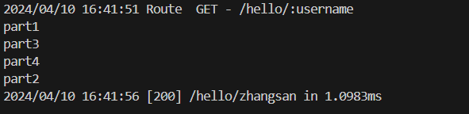

# 从零开始搭建Web框架

学习文档：

[Go语言标准库文档中文版 ](https://studygolang.com/pkgdoc)

[7天用Go从零实现Web框架Gee教程 | 极客兔兔 (geektutu.com)](https://geektutu.com/post/gee.html)

[gin-gonic/gin: Gin is a HTTP web framework written in Go (Golang).](https://github.com/gin-gonic/gin/tree/master)

## net/Http基础

go语言的http包提供了HTTP客户端和HTTP服务端的实现。下面是一个简单的HTTP服务端：

```go
package main

import (
	"fmt"
	"net/http"
)

func main() {
	http.HandleFunc("/hello",func(w http.ResponseWriter, r *http.Request) {
		fmt.Fprintln(w, "Hello World")
	}
	http.ListenAndServe(":8080", nil)
}

```

浏览器访问[127.0.0.1:8080/hello](http://127.0.0.1:8080/hello)可以看到Hello World。

```go
func ListenAndServe(addr string, handler Handler) error
```

在go标准库文档中得知ListenAndServe监听TCP地址addr，并且会使用handler参数调用Serve函数处理接收到的连接。当handler参数为nil时会使用DefaultServeMux。

而DefaultServeMux是一个ServeMux类型的实例,ServeMux拥有一个SeveHTTP方法。

```go
var DefaultServeMux = &defaultServeMux

var defaultServeMux ServeMux
```

```go
func (mux *ServeMux) ServeHTTP(w ResponseWriter, r *Request)
```

ListenAndServe函数中handler参数是Handle接口实现的实例，其中只有ServeHTTP这一个方法。 ListenAndServe函数只要传入任何实现 ServerHTTP接口的实例，所有的HTTP请求，就会交给该实例处理。

```go
type Handler interface {
    ServeHTTP(ResponseWriter, *Request)
}
```

## 框架雏形

事已至此，先创建个文件夹吧！给框架命名为kilon，目录结构如下：

```
myframe/
    ├── kilon/
    │   ├── go.mod    [1]
    │   ├── kilon.go
    ├── go.mod        [2]
    ├── main.go
```

从gin框架的实现（[gin/gin.go](https://github.com/gin-gonic/gin/blob/master/gin.go)）中可以看到gin引擎主要有以下方法：

```go
func New(opts ...OptionFunc) *Engine // 创建一个新的引擎对象
```

```go
func (origin *Engine) addRoute(method, path string, handlers HandlersChain) // 向引擎对象添加路由信息
```

```go
func (origin *Engine) ServeHTTP(w http.ResponseWriter, req *http.Request) // 实现ServeHttP接口
```

```go
func (origin *Engine) Run(addr ...string) (err error) // 启动 HTTP 服务器并监听指定的地址和端口
```

在kilon.go中模仿gin.go添加下面代码:

```go
package kilon

import (
	"fmt"
	"net/http"
)
// 给函数起别名，方便作为参数调用
type HandlerFunc func(http.ResponseWriter, *http.Request)
// 引擎对象
type Origin struct {
     // 存储路由信息的map，key为路由信息，这里使用Method + "-" + Path的格式，value为路由绑定的方法
	router map[string]HandlerFunc
}
// 创建一个新的引擎对象
func New() *Origin {
    // make函数用于slice、map以及channel的内存分配和初始化
	return &Origin{router: make(map[string]HandlerFunc)}
}
// 向引擎对象添加路由信息，并绑定函数。
func (origin *Origin) addRoute(method string, pattern string, handler HandlerFunc) {
    // Method + "-" + Path 构造key值
	key := method + "-" + pattern
    // 插入需要绑定的函数
	origin.router[key] = handler
}
// 向引擎对象注册GET、POST方法的路由信息，进行封装，降低参数数量，并提高使用时的代码可读性。
func (origin *Origin) GET(pattern string, hander HandlerFunc) {
	origin.addRoute("GET", pattern, hander)
}
func (origin *Origin) POST(pattern string, hander HandlerFunc) {
	origin.addRoute("POST", pattern, hander)
}
// 实现ServeHttP接口
func (origin *Origin) ServeHTTP(w http.ResponseWriter, req *http.Request) {
    // 从请求中携带的参数构造path
	key := req.Method + "-" + req.URL.Path 
    // 如果该路由信息已经注册，则调用绑定的函数
	if handler, ok := origin.router[key]; ok {
        // 调用绑定的函数
		handler(w, req)
	} else {
        // 路由没注册，返回 404
		fmt.Fprintf(w, "404 NOT FOUND: %s\n", req.URL)
	}
}
// 启动 HTTP 服务器并监听指定的地址和端口
func (origin *Origin) Run(addr string) (err error) {
    // 本质是调用http包的ListenAndServe启动。(实现了接口方法的 struct 可以自动转换为接口类型)
	return http.ListenAndServe(addr, origin)
}
```

至此，框架的雏形已经搭建好，实现了路由映射表、提供了用户注册方法以及包装了启动服务函数。下面在main.go中进行测试：
在go.mod [2] 中添加下面内容 （先使用指令`go mod init`生成go.mod）：

```go
replace kilon => ./kilon
```

这行代码告诉go mod 在导包时不从网上寻找包，而是使用当前目录下的kilon包。

在main.go中添加代码：

```go
package main

import (
	"fmt"
	"kilon"
	"net/http"
)

func main() {
	r := kilon.New()
	r.GET("/hello", func(w http.ResponseWriter, r *http.Request) {
		fmt.Fprintln(w, "Hello World")
	})
	r.Run(":8080") // 省略地址指监听所有网络的8080端口
}

```

运行指令：`go mod tidy` ,后可以在go.mod [2]看到：

```go
module myframe

go 1.22.1

replace kilon => ./kilon

require kilon v0.0.0-00010101000000-000000000000 // 成功导入
```

运行代码后，访问[127.0.0.1:8080/hello](http://127.0.0.1:8080/hello)可以看到Hello World。

## 上下文

```go
r.GET("/hello", func(w http.ResponseWriter, r *http.Request) {
		fmt.Fprintln(w, "Hello World")
}) // 框架雏形路由注册
```

框架雏形的使用还是有点麻烦，所有的请求与响应内容还有数据格式的处理都需要用户来实现。这时候需要引入上下文的概念来解决这个问题。上下文"（context）指的是 HTTP 请求的上下文环境，它包含了当前请求的各种信息，比如请求的 URL、HTTP 方法、请求头、请求体等等。

```go
r.GET("/hello", func(c *gin.Context) {
		c.JSON(200, gin.H{
			"message": "Hello World",
		})
}) // Gin框架路由注册
```

在 Gin 框架中，上下文由 `gin.Context`（ [gin/context.go](https://github.com/gin-gonic/gin/blob/master/context.go#L55)）类型表示，它是对 HTTP 请求的抽象，提供了丰富的方法来处理请求和响应。每当收到一个 HTTP 请求，Gin 就会创建一个新的上下文对象，然后将该对象传递给对应的处理函数。开发者可以通过这个上下文对象，方便地获取请求的相关信息（如动态路由信息，中间件信息等），以及向客户端发送响应数据。

新建context.go文件设计上下文对象，当前目录结构为：

```
myframe/
    ├── kilon/
    │   ├── context.go
    │   ├── go.mod      [1]
    │   ├── kilon.go
    ├── go.mod          [2]
    ├── main.go
```

具体实现：

创建一个名为Context的struct，写入需要便捷获取到的请求属性

```go
type Context struct {
	Writer     http.ResponseWriter
	Req        *http.Request
	Path       string // 请求路径，从req中获取
	Method     string // 请求方法，从req中获取
	StatusCode int // 响应状态码，由用户输入
}
```

写入构造方法，在构造方法中从req获取到对应属性：

```go
func newContext(w http.ResponseWriter, req *http.Request) *Context {
	return &Context{
		Writer: w,
		Req:    req,
		Path:   req.URL.Path, // 从req中获取请求路径
		Method: req.Method, // 从req中获取请求方法
	}
}
```
包装方法，让用户可以通过Context对象获取到req的信息与设置响应内容，而无需关心Context内部信息。

```go
// 从req的post表单中获取指定键的值。
func (c *Context) PostForm(key string) string {
	return c.Req.FormValue(key)
}
// 用于从req的URL查询参数中获取指定键的值。
func (c *Context) Query(key string) string {
	return c.Req.URL.Query().Get(key)
}
// 设置响应状态码
func (c *Context) Status(code int) {
	c.StatusCode = code
	c.Writer.WriteHeader(code)
}
// 发送响应数据
func (c *Context) Data(code int, data []byte) {
	c.Status(code)
	c.Writer.Write(data)
}
```

`Content-Type` 是 HTTP 头部中的一个字段，用于指示发送给客户端的实体正文的媒体类型。在标准的 HTTP 协议中，`Content-Type` 可以有很多种取值，常见的包括：

1. `text/plain`: 表示纯文本内容。
2. `text/html`: 表示 HTML 格式的文档。
3. `application/json`: 表示 JSON 格式的数据。
4. `application/xml`: 表示 XML 格式的数据。
5. `application/octet-stream`: 表示二进制流数据。
6. `image/jpeg`: 表示 JPEG 格式的图片。
7. `image/png`: 表示 PNG 格式的图片。

在框架雏形中如果用户想返回这些类型的格式数据，需要自己设置响应头部信息并将数据编码成对应格式。接下来在框架中包装多个方法，让用户可以简单的调用对应方法，就可以将数据以需要的格式响应。
```go
// 设置HTTP响应头部的指定字段和值
func (c *Context) SetHeader(key string, value string) {
	c.Writer.Header().Set(key, value)
}
// 纯文本内容，可变参数values用于实现fmt.Sprintf的包装
func (c *Context) String(code int, format string, values ...interface{}) {
	c.SetHeader("Content-Type", "text/plain")
	c.Status(code)
	c.Writer.Write([]byte(fmt.Sprintf(format, values...)))
}
// HTML格式内容
func (c *Context) HTML(code int, html string) {
	c.SetHeader("Content-Type", "text/html")
	c.Status(code)
	c.Writer.Write([]byte(html))
}
// Json格式内容
func (c *Context) JSON(code int, obj interface{}) {
	c.SetHeader("Content-Type", "application/json")
	c.Status(code)
	encoder := json.NewEncoder(c.Writer)
	if err := encoder.Encode(obj); err != nil {
		http.Error(c.Writer, err.Error(), 500)
	}
}
```

当用户想调用JSON方法时，每次都需要自己定义一个接口对象再写入数据，还是不够方便。这个时候可以给接口对象起一个别名：

```go
type H map[string]interface{}
```

这样就可以在调用的时候直接像gin框架那样直接gin.H{}写入json数据了。

现在Context.go中内容如下：

```go
package kilon

import (
	"encoding/json"
	"fmt"
	"net/http"
)

type H map[string]interface{}

type Context struct {
	Writer     http.ResponseWriter
	Req        *http.Request
	Path       string
	Method     string
	StatusCode int
}

func newContext(w http.ResponseWriter, req *http.Request) *Context {
	return &Context{
		Writer: w,
		Req:    req,
		Path:   req.URL.Path,
		Method: req.Method,
	}
}

func (c *Context) PostForm(key string) string {
	return c.Req.FormValue(key)
}

func (c *Context) Query(key string) string {
	return c.Req.URL.Query().Get(key)
}

func (c *Context) Status(code int) {
	c.StatusCode = code
	c.Writer.WriteHeader(code)
}

func (c *Context) SetHeader(key string, value string) {
	c.Writer.Header().Set(key, value)
}

func (c *Context) String(code int, format string, values ...interface{}) {
	c.SetHeader("Content-Type", "text/plain")
	c.Status(code)
	c.Writer.Write([]byte(fmt.Sprintf(format, values...)))
}

func (c *Context) JSON(code int, obj interface{}) {
	c.SetHeader("Content-Type", "application/json")
	c.Status(code)
	encoder := json.NewEncoder(c.Writer)
	if err := encoder.Encode(obj); err != nil {
		http.Error(c.Writer, err.Error(), 500)
	}
}

func (c *Context) Data(code int, data []byte) {
	c.Status(code)
	c.Writer.Write(data)
}

func (c *Context) HTML(code int, html string) {
	c.SetHeader("Content-Type", "text/html")
	c.Status(code)
	c.Writer.Write([]byte(html))
}
```

现在Context.go已经写好了，但是框架引擎的函数调用还是:

```go
type HandlerFunc func(http.ResponseWriter, *http.Request)
```

现在需要将其换成Context对象参数。

```
type HandlerFunc func(*Context)
```

并且ServeHTTP中调用逻辑需要改写：

```go
func (origin *Origin) ServeHTTP(w http.ResponseWriter, req *http.Request) {
	c := newContext(w, req) // 创建一个Context实例
	
	key := req.Method + "-" + req.URL.Path
	if handler, ok := origin.router[key]; ok {
		handler(c) // 现在路由注册的函数参数已经换成了Context对象
	} else {
		fmt.Fprintf(w, "404 NOT FOUND: %s\n", req.URL)
	}
}
```

至此上下文对象已经完成了，在main.go中测试一下：

```go
package main

import (
	"kilon"
	"net/http"
)

func main() {
	r := kilon.New()
	r.GET("/hello0", func(ctx *kilon.Context) {
		ctx.Data(http.StatusOK, []byte("Hello World"))
	})
	r.GET("/hello1", func(ctx *kilon.Context) {
		ctx.String(http.StatusOK, "Hello %s", "World")
       // ctx.String(http.StatusOK, "Hello World")
	})
	r.GET("/hello2", func(ctx *kilon.Context) {
		ctx.JSON(http.StatusOK, kilon.H{
			"message": "Hello World",
		})
	})
	r.GET("/hello3", func(ctx *kilon.Context) {
		ctx.HTML(http.StatusOK, "<h1>Hello World</h1>")

	})

	r.Run(":8080")
}
```

代码运行后访问对应地址可以看到不同结果。

## 路由

### 模块化路由

路由在kilon.go文件中导致路由和引擎交织在一起，如果要实现路由功能的拓展增强，那将会非常麻烦，这无疑降低了代码的可读性和可维护性。现在的工作是将路由从引擎里剥离出来，引擎中仅对路由进行包装。

新建文件router.go，当前目录结构为：

```
myframe/
    ├── kilon/
    │   ├── context.go
    │   ├── go.mod      [1]
    │   ├── kilon.go
    │   ├── router.go
    ├── go.mod          [2]
    ├── main.go
```

在router中添加下面内容：

```go
package kilon

import (
	"net/http"
)

type router struct {
	Handlers map[string]HandlerFunc
}
// 创建router对象
func newRouter() *router {
	return &router{make(map[string]HandlerFunc)}
}
// 剥离路由注册的具体实现
func (r *router) addRoute(method string, pattern string, handler HandlerFunc) {
	key := method + "-" + pattern
	r.Handlers[key] = handler
}
// 剥离SeverHTTP中路由处理的具体实现
func (r *router) handle(ctx *Context) {
	key := ctx.Method + "-" + ctx.Path
	if handler, ok := r.Handlers[key]; ok {
		handler(ctx)
	} else {
		ctx.String(http.StatusNotFound, "404 NOT FOUND: %s\n", ctx.Path)
	}
}
```

修改kilon.go文件：

```go
package kilon

import (
	"net/http"
)

type HandlerFunc func(*Context)

type Origin struct {
	router *router // 修改路由
}

func New() *Origin {
	return &Origin{router: newRouter()} // 修改构造函数
}

func (origin *Origin) addRoute(method string, pattern string, handler HandlerFunc) {
	origin.router.addRoute(method, pattern, handler) // 修改调用
}

func (origin *Origin) GET(pattern string, hander HandlerFunc) {
	origin.addRoute("GET", pattern, hander) 
}

func (origin *Origin) POST(pattern string, hander HandlerFunc) {
	origin.addRoute("POST", pattern, hander) 
}

func (origin *Origin) ServeHTTP(w http.ResponseWriter, req *http.Request) {
	ctx := newContext(w, req)
	origin.router.handle(ctx) // 调用router.go中的处理方法
}

func (origin *Origin) Run(addr string) (err error) {
	return http.ListenAndServe(addr, origin)
}
```

至此，实现了路由的模块化，后续路由功能的增强将不会改动kilon.go文件。

### 前缀树路由

目前的路由表使用`map`存储键值对，索引非常高效，但是有一个弊端，键值对的存储的方式，只能用来索引静态路由而无法实现动态路由。在实际的应用中，可能需要使用正则表达式或者其他匹配规则来实现更复杂的路由匹配，而 `map` 无法提供这种功能。接下来，将使用前缀树（Tire树）实现动态路由，主要实现两个功能：

- 参数匹配`:`。例如 `/p/:name/doc`，可以匹配 `/p/zhangsan/doc` 和 `/p/lisi/doc`。
- 通配`*`（仅允许最后一个有"*"号）。例如 `/static/*filepath`，可以匹配`/static/fav.ico`和`/static/js/jQuery.js`。

新建文件trie.go，当前文件目录结构为：

```
myframe/
    ├── kilon/
    │   ├── context.go
    │   ├── go.mod      [1]
    │   ├── kilon.go
    │   ├── router.go
    │   ├── tire.go
    ├── go.mod          [2]
    ├── main.go
```

在trie.go中创建前缀树的节点:

```go
type node struct {
	patten   string  // 待匹配路由
    part     string  // 路由当前部分
	children []*node // 孩子节点
	isWild   bool    // 是否为模糊搜索，当含有":"和通配符"*"时为true
}
```

当注册路由"/p/:name/doc"、"/p/:name/png"、"/p/:lang/doc"、"/p/:lang/png"后，树中内容如下：



可以看到，pattern只有在插入最后一个子节点后才会设置，这是为了在查询路由信息时可以根据 `pattern==""`来判断改路由是否注册。isWaild的作用在于当part不匹配时，如果isWaild为true可以继续搜索，这样就实现了模糊匹配。

先实现路由注册时的前缀树插入逻辑：

```go
func (n *node) insert(pattern string, parts[]string, index int)
```

pattern是注册路由地址，parts是解析pattern后的字符串数组（使用方法`strings.Split(pattern, "/")`进行解析）如"/p/:name/doc"对应 ["p",":name","doc"]，parts[index]是当前需要插入的part。可以通过index判断是否退出。（疑问：如果只用Split解析那`pattren="/"`的时候不就无法注册了吗？答：开始时树的根节点的part为空，不会匹配，"p"一定会插入到根节点的子节点切片中。而当pattern为"/"时解析字符串切片为空，进入根节点的时候`len(parts) = index = 0`,会将根节点的pattern设置为"/"，也可以实现路由"/"的注册。）

代码如下：

```go
func (n *node) insert(pattern string, parts[]string, index int){
	// 进来的时候说明 n.part = parts[index-1] 即最后一个 part 则直接设置 patten
	if len(parts) == index {
		n.patten = pattern
		return
	}
	// 还需匹配 part
	// 先在 n.children 切片中匹配 part
	part := parts[index]
	child :=  n.matchChild(part)
	// 如果没有找到，则构建一个 child 并插入 n.children 切片中
	if child == nil {
		child = &node{
			part: part,
			// 含有":"或者通配符"*"时为 true
			isWild: part[0] ==':' || part[0] == '*',
		}
		// 插入 n.children 切片
		n.children = append(n.children, child)
	}
	// 递归插入
	child.insert(pattern, parts, index + 1)
}
// 查找匹配 child
func (n *node) matchChild(part string) *node {
	// 遍历 n.children 查找 part 相同的 child
	for _, child := range n.children {
		// 如果找到匹配返回 child， 当 isWild 为 true 时视为匹配实现模糊搜索
		if child.part == part || child.isWild == true {
			return child
		}
	}	
	// 没找到返回nil
	return nil
}
```

接下来实现接受请求时查询路由信息时的前缀树搜索逻辑：

```go
func (n *node) search(parts []string, index int) *node
```

parts是路由地址的解析数组，index指向当前part索引

代码如下:

```go
// 搜索
func (n *node) search(parts []string, index int) *node {
	// 如果匹配将节点返回
	if len(parts) == index || strings.HasPrefix(n.part, "*") {
		if n.pattern == "" {
			return nil
		}
		return n
	}
	part := parts[index]
	// 获取匹配的所有孩子节点
	nodes := n.matchChildren(part)
	// 递归搜索匹配的child节点
	for _, child := range nodes {
		result := child.search(parts, index+1)
		if result != nil {
			return result
		}
	}
	return nil
}
// 查找匹配的孩子节点，由于有":"和"*"，所以可能会有多个匹配，因此返回一个节点切片
func (n *node) matchChildren(part string) []*node {
	nodes := make([]*node, 0)
	for _, child := range n.children {
		if child.part == part || child.isWild == true {
			nodes = append(nodes, child) // 将符合的孩子节点添入返回切片
		}
	}
	return nodes
}
```

至此trie.go暂时写完，现在在路由中进行应用，回到router.go文件。为了区分不同的方法如GET和POST，为每一个Method建立一颗前缀树，并以键值对的形式存储在一个map中：map[Method] = tire。修改router结构体与构造方法：

```go
type router struct {
	roots     map[string]*node       // 前缀树map
	Handlers map[string]HandlerFunc // 将pattern作为key获取/注册方法
}
func newRouter() *router {
	return &router{
		make(map[string]*node),
		make(map[string]HandlerFunc),
	}
}
```

将pattern插入前缀树之前，要先解析成字符串切片，现在需要实现一个解析函数。

```go
func parsePattern(pattern string) []string {
	temp := strings.Split(pattern, "/")
	parts := make([]string, 0)
	for _, item := range temp {
		if item != ""{
			parts = append(parts, item)
			if item[0] == '*' {
				break
			}
		}	
	}
	return parts
}
```

修改注册路由的逻辑：

```go
func (r *router) addRoute(method string, pattern string, handler HandlerFunc) {
	parts := parsePattern(pattern) // 解析pattern

	key := method + "-" + pattern

	if _, ok := r.roots[key]; !ok {
		r.roots[method] = &node{} // 如果没有则创建一个节点
	}

	r.roots[method].insert(pattern, parts, 0) // 前缀树插入pattern
	r.Handlers[key] = handler			     // 注册方法
}
```

当接受请求时，需要对请求中携带的路由信息解析，并获取匹配的节点以及":","*"匹配到的参数，现在需要写一个路由获取方法：

```go
func (r *router) getRoute(method string, path string) (*node, map[string]string) {
 	searchParts := parsePattern(path) // 解析路由信息
	params := make(map[string]string) // 参数字典
	root, ok := r.roots[method]

	if !ok {
		return nil, nil
	}
	// 搜索匹配节点
	n := root.search(searchParts, 0)

	if n!= nil {
		parts := parsePattern(n.pattern) // 解析pattern
        // 寻找'*'和':',找到对应的参数。
		for index, part := range parts {
			if part[0] == ':' {
				params[part[1:]] = searchParts[index]
			}
			if part[0] == '*' && len(part) >1 {
                // 将'*'后切片内容拼接成路径
				params[part[1:]] = strings.Join(searchParts[index:],"/")
                break // 仅允许一个通配符'*'
			}
            return n, params
		}
	}
	return nil, nil
}
```

路径中的参数应该交给上下文对象让用户便捷获取。在Context结构体中添加Params属性,并包装获取方法：

```go
type Context struct {
	Writer     http.ResponseWriter
	Req        *http.Request
	Path       string
	Method     string
	Params     map[string]string // 路由参数属性
	StatusCode int
}
// 获取路径参数
func (c *Context) Param(key string) string {
	value := c.Params[key]
	return value
}
```

在router.go中的handle中应用路由获取方法，并将路径参数提交给上下文对象。

```go
func (r *router) handle(ctx *Context) {
	n, params := r.getRoute(ctx.Method, ctx.Path) // 获取路由节点及参数字典
	ctx.Params = params
	if n != nil {
		key := ctx.Method + "-" + n.pattern // key为n的pattern
		r.Handlers[key](ctx) // 调用注册函数
	} else {
		ctx.String(http.StatusNotFound, "404 NOT FOUND: %s\n", ctx.Path)
	}
}
```

现在router.go内容为：

```go
package kilon

import (
	"net/http"
	"strings"
)

type router struct {
	roots    map[string]*node
	Handlers map[string]HandlerFunc
}

func newRouter() *router {
	return &router{
		make(map[string]*node),
		make(map[string]HandlerFunc),
	}
}

func (r *router) addRoute(method string, pattern string, handler HandlerFunc) {
	parts := parsePattern(pattern)

	key := method + "-" + pattern

	_, ok := r.roots[method]
	if !ok {
		r.roots[method] = &node{}
	}

	r.roots[method].insert(pattern, parts, 0)
	r.Handlers[key] = handler
}

func (r *router) handle(ctx *Context) {
	n, params := r.getRoute(ctx.Method, ctx.Path)
	ctx.Params = params
	if n != nil {
		key := ctx.Method + "-" + n.pattern
		r.Handlers[key](ctx)
	} else {
		ctx.String(http.StatusNotFound, "404 NOT FOUND: %s\n", ctx.Path)
	}
}

func parsePattern(pattern string) []string {
	temp := strings.Split(pattern, "/")
	parts := make([]string, 0)
	for _, item := range temp {
		if item != "" {
			parts = append(parts, item)
			if item[0] == '*' {
				break
			}
		}
	}
	return parts
}

func (r *router) getRoute(method string, path string) (*node, map[string]string) {
	searchParts := parsePattern(path)
	params := make(map[string]string)
	root, ok := r.roots[method]

	if !ok {
		return nil, nil
	}

	n := root.search(searchParts, 0)

	if n != nil {
		parts := parsePattern(n.pattern)
		for index, part := range parts {
			if part[0] == ':' {
				params[part[1:]] = searchParts[index]
			}
			if part[0] == '*' && len(part) > 1 {
				params[part[1:]] = strings.Join(searchParts[index:], "/")
				break
			}
		}
		return n, params
	}

	return nil, nil
}
```

在main.go测试一下：

```go
package main

import (
	"kilon"
	"net/http"
)

func main() {
	r := kilon.New()
	r.GET("/hello", func(ctx *kilon.Context) {
		ctx.JSON(http.StatusOK, kilon.H{
			"message": "Hello World",
		})
	})
	r.GET("/hello/:username", func(ctx *kilon.Context) {
		ctx.JSON(http.StatusOK, kilon.H{
			"message": ctx.Param("username"),
		})
	})
	r.GET("/hello/:username/*filename", func(ctx *kilon.Context) {
		ctx.JSON(http.StatusOK, kilon.H{
			"username": ctx.Param("username"),
			"filename": ctx.Param("filename"),
		})
	})
	r.Run(":8080")
}
```

分别访问下面地址，都可以看到响应信息

[127.0.0.1:8080/hello](http://127.0.0.1:8080/hello)

 [127.0.0.1:8080/hello/zhangsan](http://127.0.0.1:8080/hello/zhangsan)

[127.0.0.1:8080/hello/zhangsan/photo.png](http://127.0.0.1:8080/hello/zhangsan/photo.png)

## 分组控制

分组控制(Group Control)是 Web 框架应提供的基础功能之一。分组指路由分组，将路由分成不同的组别，然后对每个组别应用特定的策略和规则来实现管理和控制。这些策略和规则由用户通过中间件定义。

### 分组嵌套

通常情况下，分组路由以前缀作为区分，现在需要实现的分组控制也以前缀区分，并且支持分组的嵌套。例如`/post`是一个分组，`/post/a`和`/post/b`可以是该分组下的子分组。作用在`/post`分组上的中间件(middleware)，也都会作用在子分组，子分组还可以应用自己特有的中间件。

打开kilon.go添加一个路由分组的结构体：

```go
type RouterGroup struct {
	prefix string
	middlewares []HandlerFunc // 中间件函数，后续中间件的实现需要用到
	parent *RouterGroup
	origin *Origin
}
```

`prefix `是当前分组的前缀

`middleware` 中间件函数，用于中间件的实现

`parent` 指向父路由分组，用于支持嵌套分组

`origin`是引擎对象，所有的RouterGroup指向同一个引擎实例，可以让RouterGroup也调用引擎的方法

接下来在引擎中添加路由分组对象：

```go
type Origin struct {
	*RouterGroup // 用于将origin对象抽象成最顶层的RouterGroup，使得origin可以调用RouterGroup的方法
	router *router
	routerGroup []*RouterGroup // 路由分组切片，存放注册的路由分组实例
}
func New() *Origin {
	origin := &Origin{router: newRouter()} // 创建一个引擎对象实例
	origin.RouterGroup = &RouterGroup{origin: origin} // 使用引擎对象实例化RouterGroup
	origin.groups = []*RouterGroup{origin.RouterGroup} // 将origin.RouterGroup作为所有分组的父分组
	return origin
}
```

将路由都交给路由分组对象进行管理：

```go
func (group *RouterGroup) addRoute(method string, comp string, handler HandlerFunc) {
	pattern := group.prefix + comp // pattern为分组前缀prefix加上当前注册的路径
	log.Printf("Route %4s - %s",method, pattern) 
	group.origin.router.addRoute(method, pattern, handler)
}

func (group *RouterGroup) GET(pattern string, hander HandlerFunc) {
	group.addRoute("GET", pattern, hander) // 修改调用
}

func (group *RouterGroup) POST(pattern string, hander HandlerFunc) {
	group.addRoute("POST", pattern, hander) // 修改调用
}
```

接下来需要编写分组注册的方法：

```go
func (group *RouterGroup) Group(prefix string) *RouterGroup {
	origin := group.origin
	newGroup := &RouterGroup{
        parent: group, //将group作为父路由对象
		prefix: group.prefix + prefix, // 前缀为父路由对象的前缀加上当前设置的前缀	
		origin: origin, // 统一引擎对象
	}
	origin.groups = append(origin.groups, newGroup) // 将注册的路由分组存入分组切片中
	return newGroup
}
```

至此分组嵌套已经实现，接下来在main.go中测试：

```go
package main

import (
	"fmt"
	"kilon"
	"net/http"
)

func main() {
	r := kilon.New()
	group1 := r.Group("/hello")

	group1.GET("/:username", func(ctx *kilon.Context) {
		ctx.JSON(http.StatusOK, kilon.H{
			"message": fmt.Sprintf("Hello %s", ctx.Param("username")),
		})
	})

	group2 := r.Group("/file")

	group2.GET("/:filename", func(ctx *kilon.Context) {
		ctx.JSON(http.StatusOK, kilon.H{
			"file": fmt.Sprintf("zhangsan's %s", ctx.Param("filename")),
		})
	})

	r.Run(":8080")
}

```

浏览器分别访问：[127.0.0.1:8080/hello/zhangsan](http://127.0.0.1:8080/hello/zhangsan) 与 [127.0.0.1:8080/file/photo.png](http://127.0.0.1:8080/file/photo.png)

可以看到返回的JSON数据

### 中间件

在Web框架中，中间件用于处理HTTP请求和响应的过程中，对请求进行预处理、后处理或者进行一些额外的操作。中间件提供了一种灵活的方式来扩展和定制Web应用程序的功能。

接下来设计并实现 Web 框架的中间件(Middlewares)机制。在这里中间件的设计参考Gin的实现。在gin框架的context.go（[gin/context.go](https://github.com/gin-gonic/gin/blob/master/context.go)）中，中间件的实现主要与上下文对象中index与handlers两个属性以及Next方法有关：

```go
// type HandlerFunc func(*Context)
// type HandlersChain []HandlerFunc
type Context struct {
	...
	handlers HandlersChain // HandlerFunc 的切片，用于按顺序执行多个中间件函数。
	index    int8          // 表示当前需要执行哪个中间处理函数，与下面的next方法关联
    ...
}
```

当调用Next方法时，c.index++，将控制权交给下一个中间件函数。（循环的好处在于，前置中间件时可以不调用Next方法，减少代码重复）

```go
func (c *Context) Next() {
	c.index++
	for c.index < int8(len(c.handlers)) {
		c.handlers[c.index](c) 
		c.index++
	}
}
```

handlers 最后会放入用户路由注册的函数handler，基本的处理流程是这样的：当有一个请求到来时，服务器会创建一个 `Context` 对象来存储请求的相关信息，然后依次调用存储在 `handlers` 字段中的中间件函数（按照添加的顺序），并将当前的 `Context` 对象传递给这些函数。中间件函数函数调用Next方法后，会将控制权交给下一个中间件函数，直到所有中间件函数都执行完毕，最终处理请求的函数会被调用。如注册了下面两个中间件：

```go
func A(c *Context) {
    part1
    c.Next()
    part2
}
func B(c *Context) {
    part3
    c.Next()
    part4
}
```

此时`c.handlers`是这样的[A, B, Handler]，接下来的流程是这样的：`part1 -> part3 -> Handler -> part 4 -> part2`。

在context中模仿gin,改造Contex结构体：

```go
type Context struct {
	Writer     http.ResponseWriter
	Req        *http.Request
	Path       string
	Method     string
	Params     map[string]string
	StatusCode int
    // 添加index 与 handlers 属性
	index      int
	handlers   []HandlerFunc
}

func newContext(w http.ResponseWriter, req *http.Request) *Context {
	return &Context{
		Writer: w,
		Req:    req,
		Path:   req.URL.Path,
		Method: req.Method,
		index:  -1, // 初始化为-1
	}
}
// 定义Next方法
func (c *Context) Next() {
	c.index++
	for c.index < len(c.handlers){
		c.handlers[c.index](c) // 调用中间件函数
		c.index++
	}
}
```

在kilon中添加路由绑定中间件的方法：

```go
func (group *RouterGroup) Use(middleware ...HandlerFunc){
	group.middleware = append(group.middleware, middleware...)
}
```

修改ServeHTTP接口的实现：

```go
func (origin *Origin) ServeHTTP(w http.ResponseWriter, req *http.Request) {    
	var middlewares []HandlerFunc
    // 寻找所属路由分组
	for _, group := range origin.groups {
        // 将该路由分组的中间件取出
		if strings.HasPrefix(req.URL.Path, group.prefix) {
			middlewares = append(middlewares, group.middlewares...)
		}
	}	
	
	ctx := newContext(w, req)  // 创建上下文对象
	ctx.handlers = middlewares // 将中间件赋予上下文对象
	origin.router.handle(ctx)  // 在handle中将用户的路由注册的函数放入上下文对象的handlers中
}
```

在router.go的handle方法中，将路由映射的函数放入上下文对象的handlers中：

```go
func (r *router) handle(ctx *Context) {
	n, params := r.getRoute(ctx.Method, ctx.Path)
	ctx.Params = params
	if n != nil {
		key := ctx.Method + "-" + n.pattern
		ctx.handlers = append(ctx.handlers, r.Handlers[key]) // 将路由映射的函数放入上下文对象的handlers最后
	} else {
		ctx.handlers = append(ctx.handlers, func(c *Context) {
			c.String(http.StatusNotFound, "404 NOT FOUND: %s\n", c.Path)
		})
	}
    ctx.Next() // 中间件，启动！
}
```

此外，还需要定义一个方法，当请求不符合要求时，中件间可以直接跳过之后的所有处理函数，并返回错误信息：

```
func (c *Context) Fail(code int, err string) {
	c.index = len(c.handlers)
	c.JSON(code, H{"message": err})
}
```

下面实现通用的`Logger`中间件，能够记录请求到响应所花费的时间。

新建文件klogger.go，当前目录结构如下：

```
myframe/
    ├── kilon/
    │   ├── context.go
    │   ├── go.mod      [1]
    │   ├── kilon.go
    │   ├── klogger.go
    │   ├── router.go
    │   ├── tire.go
    ├── go.mod          [2]
    ├── main.go
```

向klogger.go中写入：

```go
package kilon

func Logger() HandlerFunc {
	return func(c *Context) {
		// Start timer
		t := time.Now()
		// Process request
		c.Next()
		// Calculate resolution time
		log.Printf("[%d] %s in %v", c.StatusCode, c.Req.RequestURI, time.Since(t))
	}
}
```

最后在main.go中测试：

```go
package main

import (
	"fmt"
	"kilon"
	"net/http"
)

func A() kilon.HandlerFunc{
	return func (c *kilon.Context) {
		fmt.Println("part1")
		c.Next()
		fmt.Println("part2")
	}
}

func B() kilon.HandlerFunc{
	return func (c *kilon.Context) {
		fmt.Println("part3")
		c.Next()
		fmt.Println("part4")
	}
}

func main() {
	r := kilon.New()
	group := r.Group("/hello")

	group.Use(kilon.Logger())
	group.Use(A(),B())
	
	group.GET("/:username", func(ctx *kilon.Context) {
		ctx.JSON(http.StatusOK, kilon.H{
			"message": fmt.Sprintf("Hello %s", ctx.Param("username")),
		})
	})

	r.Run(":8080")
}
```

访问[127.0.0.1:8080/hello/zhangsan](http://127.0.0.1:8080/hello/zhangsan)可以看到控制台输出：



## 模板渲染

在网页开发中，模板是指一种包含了静态文本和特定标记或占位符的文件。模板渲染是指在服务器端在模板中插入动态数据并生成最终的 HTML 页面的过程，而不是像传统的前后端耦合模式那样在客户端进行渲染。服务器会将最终生成完整的 HTML 页面发送给客户端。由于搜索引擎爬虫能够直接获取服务端渲染的 HTML 页面，因此这种方式对搜索引擎优化（SEO）更加友好，有利于网站的收录和排名。

### 静态文件支持

要实现模板渲染，服务器需要能够读取并返回像css、js这样的静态文件。接下来需要实现文件目录的路由注册方法，当请求路径中的文件在绑定的文件目录中时，将文件返回。

先来看一下使用net/http包如何实现文件服务器。

新建`static/template/welcome.html`文件，并写入下面内容：

```html
<!DOCTYPE html>
<html lang="en">
<head>
    <meta charset="UTF-8">
    <meta name="viewport" content="width=device-width, initial-scale=1.0">
    <title>welcome</title>
    
</head>
<body>
    <h1>Welcome! {{.name}}</h1>
    <p id="counter">0</p>
    <button id="incrementBtn">Increment</button>
    <!--加载js文件,src可以简写为"/static/script.js" -->
    <script src="http://127.0.0.1:8080/static/script.js"></script> 
</body>
</html>
```

新建`static/template/script.js`文件,并写入：

```js
// 获取计数器元素和按钮元素
var counterElement = document.getElementById("counter");
var incrementButton = document.getElementById("incrementBtn");

// 初始化计数器值
var count = 0;

// 点击按钮时增加计数器的值
incrementButton.addEventListener("click", function() {
  count++; // 增加计数器的值
  counterElement.innerText = count; // 更新计数器元素的文本内容
});
```

当前目录结构为：

```
myframe/
    ├── kilon/
    │   ├── context.go
    │   ├── go.mod      [1]
    │   ├── kilon.go
    │   ├── klogger.go
    │   ├── router.go
    │   ├── tire.go
    ├── static/
    │   ├── template/
    │   │   ├── script.js
    │   │   ├── welcome.html
    ├── go.mod          [2]
    ├── main.go
```

在main.go中写入：

```go
package main

import (
	"net/http"
)

func main() {
	prefix := "/static" // 设定的路由前缀
	filesystem := http.Dir("static/template") // 将文件路径转换为http.Dir类型
	fileserve := http.StripPrefix(prefix, http.FileServer(filesystem)) 
	http.Handle("/static/", fileserve)
	http.ListenAndServe(":8080", nil)
}
```

`http.Dir("static/template")`：将文件地址转换为http.Dir类型

`http.FileServer(filesystem)`：返回一个文件处理器，里面实现了ServeHTTP接口，调用他的ServeHTTP方法会将请求路径指向的文件返回。

`http.StripPrefix(prefix, http.FileServer(filesystem)) `：对文件处理器做进一步处理，将路由请求中的路由前缀去掉再传给文件处理器，这是因为文件处理器需要接受一个相对地址，而不是路由地址

`http.Handle("/static/", fileserve)`：将创建的文件处理器注册到DefaultServeMux中，路由"/static/"上的请求都会调用fileserve中的ServeHTTP方法进行处理。(注：路由不能是`"/static"`因为这样只有`"/static"`会调用注册的处理器而`/static/*`不会。)

运行后访问http://localhost:8080/static/welcome.html就可以看到页面。

这样就很明晰了，只要创建一个文件处理器，然后在接受请求的时候调用这个处理器的ServeHTTP方法就行了

打开kilon.go，先添加一个闭包，用于返回一个处理文件请求的处理函数：

```go
// 创建一个处理文件请求的handler。comp是用户定义的部分路由，最后的路由地址需要加上所属分组路由前缀
func (group *RouterGroup) creatStaticHandler(comp string, fs http.FileSystem) HandlerFunc {
	// 将分组路由前缀与用户定义的部分路由合并成路由地址
	pattern := path.Join(group.prefix, comp)
	// 创建会提取文件路径的文件处理器
	fileServer := http.StripPrefix(pattern, http.FileServer(fs))
	// 将处理文件请求的handler返回
	return func(ctx *Context) {
		file := ctx.Param("filepath")
		if _, err := fs.Open(file); err != nil {
			ctx.Status(http.StatusNotFound)
			return // 如果找不到文件返回404状态码
		}
		// 调用文件处理器的ServeHTTP方法，里面已经实现文件返回逻辑
		fileServer.ServeHTTP(ctx.Writer, ctx.Req)
	}	
}
```

再编写提供给用户挂载静态资源的方法：

```go
// 挂载静态资源，root是需要挂载的静态资源目录
func (group *RouterGroup) Static(comp string, root string) {
	handler := group.creatStaticHandler(comp, http.Dir(root)) // 创建处理文件请求的处理函数
	urlPattern := path.Join(comp, "/*filepath") // 构造动态路由地址
	group.GET(urlPattern, handler) // 路由注册
}
```

至此实现了静态文件支持功能。在main.go中测试：

```go
package main

import (
	"kilon"
)

func main() {
	r := kilon.New()
	r.Static("/static", "static/template")
	r.Run(":8080")
}
```

访问http://localhost:8080/static/welcome.html，可以看到返回的html页面。

### HTML 模板渲染

Go语言内置了`text/template`和`html/template`2个模板标准库，其中[html/template](https://golang.org/pkg/html/template/)为 HTML 提供了较为完整的支持。包括普通变量渲染、列表渲染、对象渲染等。这里直接使用`html/template`提供的能力。

现在需要在引擎中添加`template.Template` 和 `template.FuncMap`对象，前者可以将html加载进内存，后者可以对内存中的html进行渲染。

```go
type Origin struct {
	*RouterGroup
	router        *router
	groups        []*RouterGroup
	htmlTemplates *template.Template // 添加
	funcMap       template.FuncMap   // 添加
}
```

然后添加两个方法：

```go
// 用于注册模板函数到模板引擎中
func (origin *Origin) SetFuncMap(funcMap template.FuncMap){
	origin.funcMap = funcMap
}
// 用于加载指定路径的内容，并将其解析为模板对象。
func (origin *Origin) LoadHTMLGlob(pattern string){
	origin.htmlTemplates =  template.Must(template.New("").Funcs(origin.funcMap).ParseGlob(pattern))
}
```

当返回HTML内容时需要调用Context的HTML方法，因为模板对象在引擎中，为了让上下文对象可以便捷地获取到模板对象，将引擎也放入上下文对象中：

```go
type Context struct {
	Writer     http.ResponseWriter
	Req        *http.Request
	Path       string
	Method     string
	Params     map[string]string
	StatusCode int
	index      int
	handlers   []HandlerFunc
	origin     *Origin // 添加
}
```

在创建上下文对象时设置引擎：

```go
func (origin *Origin) ServeHTTP(w http.ResponseWriter, req *http.Request) {
	// ...

	ctx := newContext(w, req)
	ctx.handlers = middlewares
	ctx.origin = origin // 设置引擎对象
	origin.router.handle(ctx)
}
```

接下来增强Context的HTML方法，让它可以渲染HTML：

```go
func (c *Context) HTML(code int, name string, data interface{}) {
	c.SetHeader("Content-Type", "text/html")
	c.Status(code)
	if err := c.origin.htmlTemplates.ExecuteTemplate(c.Writer, name, data); err != nil {
		c.Fail(500, err.Error())
	}
}
```

在main.go中测试一下

```go
package main

import (
	"kilon"
	"net/http"
)

func main() {
	r := kilon.New()
	r.LoadHTMLGlob("static/template/*")
	r.Static("/static", "static/template")
	r.GET("/:name", func(c *kilon.Context) {
		c.HTML(http.StatusOK, "welcome.html", kilon.H{
			"name":  c.Param("name"),
		})
	})
	r.Run(":8080")
}
```

访问http://127.0.0.1:8080/zhangsan 可以看到：


## 错误恢复

对一个Web框架而言，错误恢复是非常重要的，因为如果用户注册的函数出现了数组越界等错误，整个Web服务就会宕机。下面将使用中间件，为框架添加错误恢复的功能。

新建文件recover.go，当前目录结构为：

```
myframe/
    ├── kilon/
    │   ├── context.go
    │   ├── go.mod      [1]
    │   ├── kilon.go
    │   ├── klogger.go
    │   ├── recover.go
    │   ├── router.go
    │   ├── tire.go
    ├── static/
    │   ├── template/
    │   │   ├── script.js
    │   │   ├── welcome.html
    ├── go.mod          [2]
    ├── main.go
```

在revober.go 中写入：

```go
package kilon

import (
	"fmt"
	"log"
	"net/http"
	"runtime"
)

func Recovery() HandlerFunc {
	return func(c *Context) {
		defer func() {
			if err := recover(); err != nil {
				message := fmt.Sprintf("%s", err) // 获取错误信息
				buf := make([]byte, 1024)
				n := runtime.Stack(buf, false) // 获取堆栈信息
				log.Printf("%s\n", message) // 打印错误信息
				log.Printf("%s\n", buf[:n]) // 打印堆栈信息
				c.Fail(http.StatusInternalServerError, "Internal Server Error") // 返回服务器错误给客户端
			}
		}()

		c.Next()
	}
}
```

最后给引擎的获取与默认中间件的注册再包装一层方法，在kilon.go中添加Default方法：

```go
func Default() *Origin {
	origin := New()
	origin.Use(Logger(), Recovery()) // 注册中间件
	return origin
}
```

在main.go中测试：

```go
package main

import (
	"net/http"

	"kilon"
)

func main() {
	r := kilon.Default()
	r.GET("/", func(c *kilon.Context) {
		c.String(http.StatusOK, "Hello World\n")
	})
	
	r.GET("/panic", func(c *kilon.Context) {
		names := []string{"Hello_World"}
		c.String(http.StatusOK, names[100])
	})

	r.Run(":8080")
}
```

访问[127.0.0.1:8080/panic](http://127.0.0.1:8080/panic)可以看到相应信息：

```json
{
    "message": "Internal Server Error"
}
```

并在控制台看到错误信息与堆栈信息：

```
2024/04/11 19:50:19 Route  GET - /
2024/04/11 19:50:19 Route  GET - /panic
2024/04/11 19:50:28 runtime error: index out of range [100] with length 1
2024/04/11 19:50:28 goroutine 19 [running]:
kilon.Default.Recovery.func2.1()
        E:/workplace/GoProject/src/myframe/kilon/recovery.go:16 +0x8e
panic({0x5e6dc0?, 0xc000280048?})
        E:/compiler/Go/go1.22.1/src/runtime/panic.go:770 +0x132      
main.main.func2(0x34e73b?)
        e:/workplace/GoProject/src/myframe/main.go:17 +0x17
kilon.(*Context).Next(0xc0002bc000)
        E:/workplace/GoProject/src/myframe/kilon/context.go:36 +0x26 
kilon.Default.Recovery.func2(0xc0000299d0?)
        E:/workplace/GoProject/src/myframe/kilon/recovery.go:23 +0x45
kilon.(*Context).Next(0xc0002bc000)
        E:/workplace/GoProject/src/myframe/kilon/context.go:36 +0x26 
kilon.Default.Logger.func1(0xc0002bc000)
        E:/workplace/GoProject/src/myframe/kilon/klogger.go:13 +0x3b 
kilon.(*Context).Next(...)
        E:/workplace/GoProject/src/myframe/kilon/context.go:36       
kilon.(*router).handle(0xc00008a100, 0xc0002bc000)
        E:/workplace/GoProject/src/myframe/kilon/router.go:45 +0x1df
kilon.(*Origin).ServeHTTP(0xc00009e280, {0x67f270, 0xc0002aa000}, 0xc000180000)
        E:/workplace/GoProject/src/myframe/kilon/kilon.go:
2024/04/11 19:50:28 [500] /panic in 1.3465ms
```

并且服务器没有宕机，可以继续访问[127.0.0.1:8080](http://127.0.0.1:8080/)看到hello world回应。


