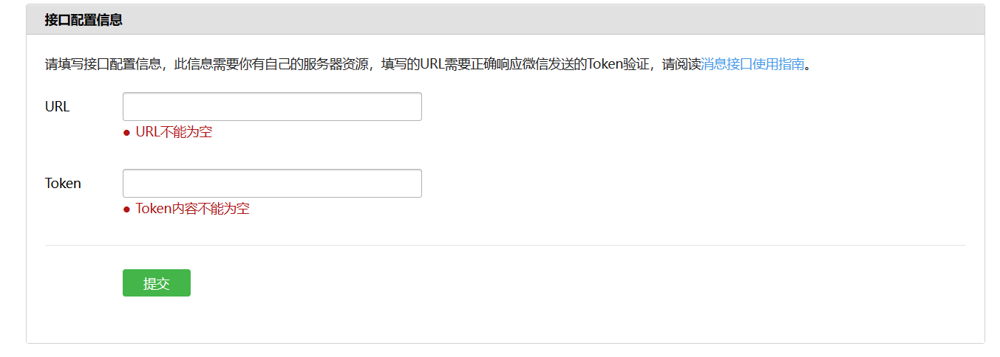

[TOC]

# 扫码登陆

## 前置准备

80/443端口能被联网访问：内网穿透、云服务器（测试号无需域名，ip即可）

申请测试号：[微信公众平台 (qq.com)](https://mp.weixin.qq.com/debug/cgi-bin/sandbox?t=sandbox/login)

### 测试号接口配置

[开始开发 / 接入指南 (qq.com)](https://developers.weixin.qq.com/doc/offiaccount/Basic_Information/Access_Overview.html)



`Token`随便写入，用于判断请求是否来自微信服务器。

`URl`绑定需要编写一个接口用来接收微信的信息：

- 接收微信GET请求传来四个参数 （后续事件推送也会POST到这个接口）

- 返回参数中的Echostr参数 

（gin框架）

```go
wxgroup := r.Group("/wechat")
{
	wxgroup.Any("/message",controller.WxMessage)
}
r.Run(":80") // 80 端口启动服务
```

```go
func WxMessage(ctx *gin.Context) {
	vp := &wxgo.VerifyParams{
		Signature: ctx.Query("signature"),
		Echostr:   ctx.Query("echostr"),
		Timestamp: ctx.Query("timestamp"),
		Nonce:     ctx.Query("nonce"),
	}
    // 判断请求是否来自微信服务器。
	if flag, _ := wechat.Wx.VerifySignature(*vp); flag {
		log.Println(vp)
        // 返回echostr字符串
		ctx.String(http.StatusOK, vp.Echostr)
	}
}
```
开发者提交信息后，微信服务器将发送GET请求到填写的服务器地址URL上，GET请求携带参数如下表所示：

| 参数      | 描述                                                         |
| :-------- | :----------------------------------------------------------- |
| signature | 微信加密签名，signature结合了开发者填写的token参数和请求中的timestamp参数、nonce参数。 |
| timestamp | 时间戳                                                       |
| nonce     | 随机数                                                       |
| echostr   | 随机字符串                                                   |

开发者通过检验signature对请求进行校验（下面有校验方式）。若确认此次GET请求来自微信服务器，请原样返回echostr参数内容，则接入生效，成为开发者成功，否则接入失败。加密/校验流程如下：

1）将token、timestamp、nonce三个参数进行字典序排序

2）将三个参数字符串拼接成一个字符串进行sha1加密

3）开发者获得加密后的字符串可与signature对比，标识该请求来源于微信

检验signature的Golang示例代码：

```go
// 签名验证
func (w *Wechat) VerifySignature(vp VerifyParams) (res bool, err error) {
	// 获取 token 字段， 为接口配置设置的token参数
	token, err := w.Cfg.GetToken()
	if err != nil {
		return false, err
	}
	// 构造匹配字段
	strs := []string{vp.Timestamp, vp.Nonce, token}
	// 按字典序排列后拼接成一个字符串
	sort.Strings(strs)
	str := strings.Join(strs, "")
	// 对拼接后的字符串进行 SHA1 加密
	hash := sha1.New()
	hash.Write([]byte(str))
	hashed := fmt.Sprintf("%x", hash.Sum(nil))
	// 加密结果与 signature 比较
	if hashed != vp.Signature {
		return false, errors.New("error: Signature mismatch")
	}
	return true, nil
}
```

将接口地址http://your_ip:80/wechat/message写入配置信息中的URL即可配置成功

## 带参数二维码登陆

[账号管理 / 生成带参数的二维码 (qq.com)](https://developers.weixin.qq.com/doc/offiaccount/Account_Management/Generating_a_Parametric_QR_Code.html)

流程：

- 获取access token
- 通过access token与一些请求参数获取二维码ticket
- 通过ticket换取二维码url，返回给前端
- 用户扫描二维码后事件信息推送到消息接口、将ticket放入redis
- 前端用ticket轮训是否已经登陆
### 获取access token

[开始开发 / 获取 Access token (qq.com)](https://developers.weixin.qq.com/doc/offiaccount/Basic_Information/Get_access_token.html)

- 在测试号信息下获取：appID、appsecret

- 用http client发送请求获取access token

**接口调用请求说明**

> https请求方式: GET https://api.weixin.qq.com/cgi-bin/token?grant_type=client_credential&appid=APPID&secret=APPSECRET

**参数说明**

| 参数       | 是否必须 | 说明                                  |
| :--------- | :------- | :------------------------------------ |
| grant_type | 是       | 获取access_token填写client_credential |
| appid      | 是       | 第三方用户唯一凭证                    |
| secret     | 是       | 第三方用户唯一凭证密钥，即appsecret   |

**返回说明**

正常情况下，微信会返回下述JSON数据包给公众号：

```json
{"access_token":"ACCESS_TOKEN","expires_in":7200}
```

**参数说明**

| 参数         | 说明                   |
| :----------- | :--------------------- |
| access_token | 获取到的凭证           |
| expires_in   | 凭证有效时间，单位：秒 |

错误时微信会返回错误码等信息，JSON数据包示例如下（该示例为AppID无效错误）:

```json
{"errcode":40013,"errmsg":"invalid appid"}
```

```go
// 获取普通access token
func (w *Wechat) GetATReq() error {
	// 获取appID与appsecret
	appid, err := w.Cfg.GetAppid()
	if err != nil {
		return err
	}
	appsecret, err := w.Cfg.GetAppsecret()
	if err != nil {
		return err
	}
	// 构造请求地址
    // ReqUrl.ATUrl: "https://api.weixin.qq.com/cgi-bin/token?grant_type=client_credential&appid=%s&secret=%s",
	url := fmt.Sprintf(ReqUrl.ATUrl, appid, appsecret)
	// 发送 GET 请求获取响应
	client := &http.Client{}
	req, err := http.NewRequest("GET", url, nil)
	if err != nil {
		return err
	}
	resp, err := client.Do(req)
	if err != nil {
		return err
	}
	defer resp.Body.Close()
	// 读取响应
	body, err := io.ReadAll(resp.Body)
	if err != nil {
		return err
	}
	// 如果响应结果包含错误错误码，返回错误信息
	if strings.Contains(string(body), "errcode") {
		return fmt.Errorf("wechat response error: %s", string(body))
	}
	// 解析字符串
	err = json.Unmarshal(body, &w.LatestAT)
	if err != nil {
		return errors.New("json Unmarshal fail")
	}
	// 设置成功获取时间
	w.LatestAT.Time = time.Now()
	return nil
}
```

```go
// wechat 用于保存at与配置信息
type Wechat struct {
	Cfg      *WechatCfg
	LatestAT *AT
}
// access token
type AT struct {
	AccessToken string `json:"access_token"`
	ExpiresTime int    `json:"expires_in"`
	Time        time.Time // access token获取时间
}
// 配置
type WechatCfg struct {
	Token       string
	Appid       string
	Appsecret   string
	ExpiresTime int
}
// 获取 accesstoken
func (w *Wechat) GetAccessToken() (at string, err error) {
	w.RefreshAT()
	return w.LatestAT.AccessToken, nil
}
// 刷新 LatestAT
func (w *Wechat) RefreshAT() error {
	// 先判断上次获取的是否超时
	duration := time.Since(w.LatestAT.Time)
	durationInSeconds := int(duration.Seconds())
	if durationInSeconds < (w.LatestAT.ExpiresTime - 600) {
		return nil
	}
    // 发送请求获取access token
	err := w.GetATReq()
	return err
}
```

### 获取Ticket

**创建二维码ticket**

每次创建二维码ticket需要提供一个开发者自行设定的参数（scene_id），分别介绍临时二维码和永久二维码的创建二维码ticket过程。

**临时二维码请求说明**

> http请求方式: POST URL: https://api.weixin.qq.com/cgi-bin/qrcode/create?access_token=TOKEN POST数据格式：json POST数据例子：{"expire_seconds": 604800, "action_name": "QR_SCENE", "action_info": {"scene": {"scene_id": 123}}} 或者也可以使用以下POST数据创建字符串形式的二维码参数：{"expire_seconds": 604800, "action_name": "QR_STR_SCENE", "action_info": {"scene": {"scene_str": "test"}}}

**参数说明**

| 参数           | 说明                                                         |
| :------------- | :----------------------------------------------------------- |
| expire_seconds | 该二维码有效时间，以秒为单位。 最大不超过2592000（即30天），此字段如果不填，则默认有效期为60秒。 |
| action_name    | 二维码类型，QR_SCENE为临时的整型参数值，QR_STR_SCENE为临时的字符串参数值，QR_LIMIT_SCENE为永久的整型参数值，QR_LIMIT_STR_SCENE为永久的字符串参数值 |
| action_info    | 二维码详细信息                                               |
| scene_id       | 场景值ID，临时二维码时为32位非0整型，永久二维码时最大值为100000（目前参数只支持1--100000） |
| scene_str      | 场景值ID（字符串形式的ID），字符串类型，长度限制为1到64      |

```go
func (w *Wechat) GetQRTicketReq(codetype string, sceneId int) (string, error) {
	// 获取 access token
	at, err := w.GetAccessToken()
	if err != nil {
		return "", err
	}
	// 拼接请求地址
	url := fmt.Sprintf(ReqUrl.TicketUrl, at)
	// 构造请求数据
	data := &QRCodeReq{
		ExpireSeconds: w.Cfg.GetExpiresTime(),
		ActionName:    codetype, // QR码 类型
		ActionInfo: ActionInfo{
			Scene: Scene{
				SceneId: sceneId,
			},
		},
	}
	// 发送 post 请求获取响应
	client := &http.Client{}
	Jsondata, err := json.Marshal(&data)
	if err != nil {
		return "", err
	}
	reader := bytes.NewReader(Jsondata)
	req, err := http.NewRequest("POST", url, reader)
	if err != nil {
		return "", err
	}
	// 设置请求头 json格式
	req.Header.Set("Content-Type", "application/json")
	resp, err := client.Do(req)
	if err != nil {
		return "", err
	}
	defer resp.Body.Close()
	// 读取响应
	body, err := io.ReadAll(resp.Body)
	if err != nil {
		return "", err
	}
	var respData = QRCodeRes{}
	// 解析字符串
	err = json.Unmarshal(body, &respData)
	if err != nil {
		return "", errors.New("json unmarsha fail")
	}
	return respData.Ticket, nil
}
```

### 拼装二维码Url

**通过ticket换取二维码**

获取二维码ticket后，开发者可用ticket换取二维码图片。请注意，本接口无须登录态即可调用。

**请求说明**

> HTTP GET请求（请使用https协议）https://mp.weixin.qq.com/cgi-bin/showqrcode?ticket=TICKET 提醒：TICKET记得进行UrlEncode

**返回说明**

ticket正确情况下，http 返回码是200，是一张图片，可以直接展示或者下载。

> HTTP头（示例）如下： Accept-Ranges:bytes Cache-control:max-age=604800 Connection:keep-alive Content-Length:28026 Content-Type:image/jpg Date:Wed, 16 Oct 2013 06:37:10 GMT Expires:Wed, 23 Oct 2013 14:37:10 +0800 Server:nginx/1.4.1

错误情况下（如ticket非法）返回HTTP错误码404。

```go
func (w *Wechat) GetQrImageUrl(ticket string) string {
	ticket = url.QueryEscape(ticket) // 进行UrlEncode
    // ReqUrl.QRImgUrl: "https://mp.weixin.qq.com/cgi-bin/showqrcode?ticket=%s"
	url := fmt.Sprintf(ReqUrl.QRImgUrl,ticket)
	return url
}
```

### 编写接口返回二维码

```go
wxgroup.GET("/getloginqr",controller.GetGZQrUrl)
```

```go
// 获取公众号登陆二维码
func GetGZQrUrl(ctx *gin.Context) {
    // 获取ticket
	ticket, _ := wechat.Wx.GetQRTicketReq("QR_STR_SCENE", 123)
    // 拼装二维码url
	qrUrl := wechat.Wx.GetQrImageUrl(ticket)
	ctx.JSON(http.StatusOK, gin.H{
		"ticket": ticket,
		"qrUrl":  qrUrl,
	})
}
```

### 接收扫描带参数二维码事件

[基础消息能力 / 接收事件推送 (qq.com)](https://developers.weixin.qq.com/doc/offiaccount/Message_Management/Receiving_event_pushes.html)[基础消息能力 / 接收事件推送 (qq.com)](https://developers.weixin.qq.com/doc/offiaccount/Message_Management/Receiving_event_pushes.html)

用户扫描带场景值二维码时，可能推送以下两种事件：

1. 如果用户还未关注公众号，则用户可以关注公众号，关注后微信会将带场景值关注事件推送给开发者。
2. 如果用户已经关注公众号，则微信会将带场景值扫描事件推送给开发者。

推送XML数据包示例：

```xml
<xml>
  <ToUserName><![CDATA[toUser]]></ToUserName>
  <FromUserName><![CDATA[FromUser]]></FromUserName>
  <CreateTime>123456789</CreateTime>
  <MsgType><![CDATA[event]]></MsgType>
  <Event><![CDATA[subscribe]]></Event>
  <EventKey><![CDATA[qrscene_123123]]></EventKey>
  <Ticket><![CDATA[TICKET]]></Ticket>
</xml>
```

参数说明：

| 参数         | 描述                                             |
| :----------- | :----------------------------------------------- |
| ToUserName   | 开发者微信号                                     |
| FromUserName | 发送方账号（一个OpenID）                         |
| CreateTime   | 消息创建时间 （整型）                            |
| MsgType      | 消息类型，event                                  |
| Event        | 事件类型，subscribe（关注） / SCAN（之前已关注） |
| EventKey     | 事件KEY值，qrscene_为前缀，后面为二维码的参数值  |
| Ticket       | 二维码的ticket，可用来换取二维码图片             |

在最开始时的消息接口添加消息处理逻辑，接收到扫描带参数二维码事件推送后将ticket和openid放入redis

```go
func WxMessage(ctx *gin.Context) {
	vp := &wxgo.VerifyParams{
		Signature: ctx.Query("signature"),
		Echostr:   ctx.Query("echostr"),
		Timestamp: ctx.Query("timestamp"),
		Nonce:     ctx.Query("nonce"),
	}
	if flag, _ := wechat.Wx.VerifySignature(*vp); flag {
		log.Println(vp)
		ctx.String(http.StatusOK, vp.Echostr)
	}
    // 添加消息处理逻辑
	uEvent := &wxgo.UserEvent{}
	ctx.ShouldBindXML(&uEvent)
	fmt.Println(uEvent)
	if uEvent.Ticket != "" && (uEvent.Event == "SCAN" || uEvent.Event == "subscribe") {
		openid := uEvent.FromUserName
		log.Printf("ticket:%s, openid:%s", uEvent.Ticket, openid)
		// 将ticket和openid存入redis
		err := redis.RedisClient.Set(uEvent.Ticket, openid, 60*time.Second).Err()
		if err != nil {
			log.Println(err.Error())
		}
	}
}

```

```go
// 用户事件
type UserEvent struct {
	ToUserName   string `xml:"ToUserName"`   // 开发者微信号
	FromUserName string `xml:"FromUserName"` // 发送方账号（一个OpenID）
	CreateTime   int    `xml:"CreateTime"`   // 消息创建时间（整型）
	MsgType      string `xml:"MsgType"`      // 消息类型，event,
	Event        string `xml:"Event"`        // 事件类型，subscribe（关注）, SCAN（已关注）
	EventKey     string `xml:"EventKey"`     // 事件KEY值，qrscene_为前缀，后面为二维码的参数值
	Ticket       string `xml:"Ticket"`       // 二维码的ticket，可用来换取二维码图片
}
```

### 编写登陆轮训接口

前端需要传递参数ticket询问是否登陆

```go
// 登陆轮训接口
func CheckLogin(ctx *gin.Context) {
	ticket := ctx.Query("ticket")
    // 从redis中读取ticket
	openid, err := redis.RedisClient.Get(ticket).Result()
	if err != nil {
		ctx.JSON(http.StatusOK, gin.H{
			"login": false,
		})
	} else {
		ctx.JSON(http.StatusOK, gin.H{
			"login":  true,
			"openid": openid,
		})
	}
}
```

```go
wxgroup.GET("/checklogin",controller.CheckLogin)
```

### 测试页面

**修改两处请求地址**

```html
<!DOCTYPE html>
<html lang="en">
<head>
    <meta charset="UTF-8">
    <meta name="viewport" content="width=device-width, initial-scale=1.0">
    <title>登录页面</title>
    <style>
        #qr-code {
            width: 200px;
            height: 200px;
        }
    </style>
</head>
<body>

    <div id="qr-code-container">
        
    </div>
    <h1 id="login-status"></h1>
    <h3 id="login-user"></h3>
    <script>
        // 请求后端获取二维码图片地址
        function getQRCode() {
            // 修改请求地址
            fetch('http://your_ip/wechat/getloginqr') // 假设'/get_qr_code'是后端提供的接口地址
            .then(response => response.json())
            .then(data => {
                console.log(data.qrUrl)
                document.getElementById('qr-code').src = data.qrUrl;
                // 开始轮询检查登录状态
                // 根据问号分割URL，获取问号后面的部分
                var queryString = data.qrUrl.split('?')[1];
                // 根据等号分割查询字符串，获取ticket参数的值
                var ticket = queryString.split('=')[1];
                console.log(ticket);
                checkLoginStatus(ticket);
            })
            .catch(error => console.error('Error:', error));
        }

        // 轮询检查登录状态
        function checkLoginStatus(ticket) {
            // 修改请求地址
            url = 'http://your_ip/wechat/checklogin?ticket='+ ticket
            console.log(url)
            var checkLoginInterval = setInterval(() => {
                fetch(url) // 假设'/check_login_status'是后端提供的接口地址
                .then(response => response.json())
                .then(data => {
                    console.log(data)
                    if (data.login) {
                        document.getElementById('login-status').innerText = '登录成功';
                        document.getElementById('login-user').innerText = 'Openid: ' + data.openid; 
                        clearInterval(checkLoginInterval); // 登录成功后停止轮询
                    } 
                })
                .catch(error => console.error('Error:', error));
            }, 2000); // 每隔2秒轮询一次
        }

        // 页面加载完成后立即获取二维码
        window.onload = function() {
            getQRCode();
        };
    </script>
</body>
</html>
```

## 网页授权二维码登陆

[微信网页开发 / 网页授权 (qq.com)](https://developers.weixin.qq.com/doc/offiaccount/OA_Web_Apps/Wechat_webpage_authorization.html)

微信公众测试号不支持PC端网页登陆，但是可以模拟带参数二维码的登陆流程来实现类似的功能

流程：

-  生成`ticket`作为授权地址的state参数
- 编写接口作为授权地址都rederct_url参数
- 用授权地址生成QR码，并将QR码与ticket返回给前端
- 用户扫描QR码将携带code和state参数重定向到接口
- 接口接收code和state中的ticket参数，用code向微信服务器获取用户的access token和open id
- 将ticket和openid存入redis
- 前端用ticket轮训是否登陆

### 生成ticket

生成随机字符串

```go
func GenerateRandomTicket(length int) string {
	rand.Seed(time.Now().UnixNano())
	var letters = []rune("abcdefghijklmnopqrstuvwxyzABCDEFGHIJKLMNOPQRSTUVWXYZ0123456789")
	b := make([]rune, length)
	for i := range b {
		b[i] = letters[rand.Intn(len(letters))]
	}
	return string(b)
}
```

### 生成授权地址

在确保微信公众账号拥有授权作用域（scope参数）的权限的前提下（已认证服务号，默认拥有scope参数中的snsapi_base和snsapi_userinfo 权限），引导关注者打开如下页面：

> https://open.weixin.qq.com/connect/oauth2/authorize?appid=APPID&redirect_uri=REDIRECT_URI&response_type=code&scope=SCOPE&state=STATE#wechat_redirect

**参数说明**

| 参数             | 是否必须 | 说明                                                         |
| :--------------- | :------- | :----------------------------------------------------------- |
| appid            | 是       | 公众号的唯一标识                                             |
| redirect_uri     | 是       | 授权后重定向的回调链接地址， 请使用 urlEncode 对链接进行处理 |
| response_type    | 是       | 返回类型，请填写code                                         |
| scope            | 是       | 应用授权作用域，snsapi_base （不弹出授权页面，直接跳转，只能获取用户openid），snsapi_userinfo （弹出授权页面，可通过openid拿到昵称、性别、所在地。并且， 即使在未关注的情况下，只要用户授权，也能获取其信息 ） |
| state            | 否       | 重定向后会带上state参数，开发者可以填写a-zA-Z0-9的参数值，最多128字节 |
| #wechat_redirect | 是       | 无论直接打开还是做页面302重定向时候，必须带此参数            |
| forcePopup       | 否       | 强制此次授权需要用户弹窗确认；默认为false；需要注意的是，若用户命中了特殊场景下的静默授权逻辑，则此参数不生效 |

```go
// 生成ticket
ticket := wxgo.GenerateRandomTicket(20)
// 生成授权地址
redirect_url := "http://39.101.78.10/wechat/accessusercode" // 微信授权后重定向地址,用于接收用户code
scope := "snsapi_base" //授权权限
oauthUrl := wechat.Wx.GetOauth2CodeUrl(redirect_url, scope, ticket) // 授权地址
```

```go
// Oauth2CodeUrl: "https://open.weixin.qq.com/connect/oauth2/authorize?appid=%s&redirect_uri=%s&response_type=code&scope=%s&state=%s#wechat_redirect"
func (w *Wechat) GetOauth2CodeUrl(redirectUrl string, scope string, state string) string {
	encodeUrl := url.QueryEscape(redirectUrl)
	url := fmt.Sprintf(ReqUrl.Oauth2CodeUrl, w.Cfg.Appid, encodeUrl, scope, state)
	return url
}
```

### 获取QR码

#### 静态文件支持

qr码保存到服务器中，需要联网访问到

```go
r.Static("/static","resource")
```

#### 编写获取QR码的接口

```go
wxgroup.GET("/getauthqr",controller.GetAuthQrUrl)
```

```go
// 获取网页授权登陆二维码
func GetAuthQrUrl(ctx *gin.Context) {
	// 生成ticket
	ticket := wxgo.GenerateRandomTicket(20)
	// 生成授权地址
	redirect_url := "http://your_ip/wechat/accessusercode" // 微信授权后重定向地址,用于接收用户code
	scope := "snsapi_base"                                  //授权权限
	oauthUrl := wechat.Wx.GetOauth2CodeUrl(redirect_url, scope, ticket)
	// 将授权地址生成QR码
	savePath := "./resource/image"
	err := wxgo.GenerateQrCode(oauthUrl, savePath, ticket)
	if err != nil {
		log.Fatal(err.Error())
		return
	}
	qrUrl := fmt.Sprintf("http://your_ip/static/image/%s.png", ticket)
	ctx.JSON(http.StatusOK, gin.H{
		"ticket": ticket,
		"qrUrl":  qrUrl,
	})
}
```

GenerateQrCode:

```go
func GenerateQrCode(url string, savedir string, fname string) error {
    // "github.com/skip2/go-qrcode" 包
	qrcode, err := qrcode.New(url, qrcode.Highest)
	if err != nil {
		return err
	}
	qrcode.DisableBorder = true
	//保存成文件
	savepath := fmt.Sprintf("%s/%s.png", savedir, fname)
	err = qrcode.WriteFile(256, savepath)
	return err
}
```

### 接收重定向参数

如果用户同意授权，页面将跳转至 redirect_uri/?code=CODE&state=STATE。

> code说明：code作为换取access_token的票据，每次用户授权带上的code将不一样，code只能使用一次，5分钟未被使用自动过期。

```go
// 网页授权接收code
func AccessUserCode(ctx *gin.Context) {
	code := ctx.Query("code")
	ticke := ctx.Query("state")
	// 用code获取用户access token
	uat, _ := wechat.Wx.GetUserATReq(code)
	// 用access token获取用户信息
	uInfo, _ := wechat.Wx.GetUserInfoReq(uat)
	log.Printf(uInfo.NickName, uInfo.Headimgurl, uInfo.City)
	// 将ticket和openid放入redis
	redis.RedisClient.Set(ticke, uInfo.OpenId, 60*time.Second)
	// 重定向到成功/失败页面
	ctx.Redirect(http.StatusTemporaryRedirect, "http://39.101.78.10/static/html/loginsucceed.html")
}
```

### 轮训登陆接口

复用带参数二维码的登陆轮训接口

### 测试页面

```html
<!DOCTYPE html>
<html lang="en">
<head>
    <meta charset="UTF-8">
    <meta name="viewport" content="width=device-width, initial-scale=1.0">
    <title>登录页面</title>
    <style>
        #qr-code {
            width: 200px;
            height: 200px;
        }
    </style>
</head>
<body>

    <div id="qr-code-container">
        
    </div>
    <h1 id="login-status"></h1>
    <h3 id="login-user"></h3>
    <script>
        // 请求后端获取二维码图片地址
        function getQRCode() {
        	// 修改ip
            fetch('http://your_ip/wechat/getauthqr') 
            .then(response => response.json())
            .then(data => {
                console.log(data.qrUrl)
                document.getElementById('qr-code').src = data.qrUrl;
                // 开始轮询检查登录状态
                var ticket = data.ticket;
                console.log(ticket);
                checkLoginStatus(ticket);
            })
            .catch(error => console.error('Error:', error));
        }

        // 轮询检查登录状态
        function checkLoginStatus(ticket) {
            // 修改ip
            url = 'http://your_ip/wechat/checklogin?ticket='+ ticket
            console.log(url)
            var checkLoginInterval = setInterval(() => {
                fetch(url) // 假设'/check_login_status'是后端提供的接口地址
                .then(response => response.json())
                .then(data => {
                    console.log(data)
                    if (data.login) {
                        document.getElementById('login-status').innerText = '登录成功';
                        document.getElementById('login-user').innerText = 'Openid: ' + data.openid; 
                        clearInterval(checkLoginInterval); // 登录成功后停止轮询
                    } 
                })
                .catch(error => console.error('Error:', error));
            }, 2000); // 每隔2秒轮询一次
        }

        // 页面加载完成后立即获取二维码
        window.onload = function() {
            getQRCode();
        };
    </script>
</body>
</html>

```

