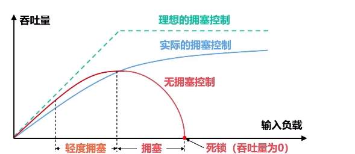

[toc]
学习地址：[5.3.4-5.3.5 TCP的拥塞控制以及与网际层拥塞控制的关系](https://www.bilibili.com/video/BV1NT411g7n6?p=87&vd_source=c0b651bd06045ff726218e3d90558160)

# 拥塞控制

## 基本概念

 - 在某段时间，**若对网络中某资源的需求超过了该资源所能提供的可用部分，网络的性能就要明显变坏**，整个网络的吞吐量将随输入负荷的增大而下降。这种现象称为**拥塞**(congestion)。
 - 若出现拥塞而不进行控制，可能会导致整个**系统崩溃**。
    

## 基本方法

